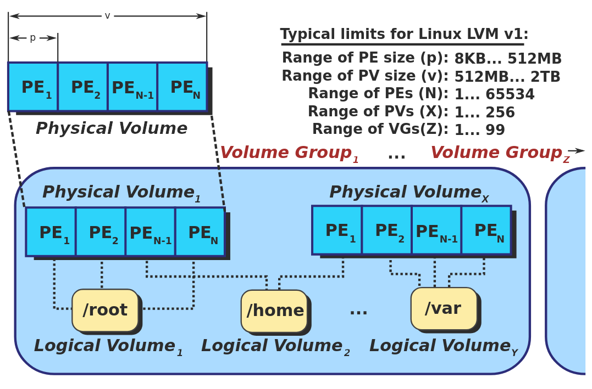

# CC

## Find

Comment se comporte la commande `find` avec les fichiers ?
(est ce que elle à un comportement récursif c-à-d est ce quelle va chercher 
dans les sous dossier du dossier courant)

%

La commande sans option ne regarde que le dossier courant.

## Globing

J'ai cette architecture de dossier :

```sh
.
├── Components
│   ├── comps.txt
│   ├── main.html
│   └── menu.html
├── CSS
│   ├── app.css
│   ├── menu.css
│   └── readme.txt
├── index.html
├── JS
│   ├── api-doc.txt
│   └── app.js
└── listing.txt
```

Que fera la commande `echo *.txt` ?

%

Elle ne renvera que `listing.txt` car le globing n'est pas récursif sur les 
dossiers.

## name

Que fais l'option `-name` sur la commande `find` ?

%

Elle permet de faire une recherche sur des noms de fichiers.

## Writing

Décrire présicément ce que fait `X > Y` sur `Y`.

%

Réinitialise `Y` (éfface tous sont contenu), écris la sortie standard de `X` 
dans `Y` dépuis le début de `Y`.

## Bash

Donner la différence entre `>&` et `2>`.

%

- `>&` redirige la sortie d'érreur et la sortie standard.
- `2>` ne redirige que la sortie d'erreur.

## Periphe

Selon la nomenclature du noyaux Linux, à quoi correspondent respectivement les 
périphériques `/dev/sdc` et `/dev/sda4` ?

%

- `/dev/sdc` : correspond à un périphérique de type bloque.
- `/dev/sda4` : correspond à une partition d'un périphérique de type bloque.

## Monter

Donner la commande permettant de monté un système de fichier.

%

`sudo mount /path/to/ /mnt/un/dossier`

## Démonter

Donner la commande permettant de démonté un système de fichier.

%

`sudo umount /path/to /mnt/un/dossier`

## Monter

Comment monté un système de fichier à l'aide de l'UUID d'un périphérie de type
bloque ou bien d'une partition ?

%

`sudo mount -U <UUID> /mnt`

## Monter

Donner deux commande pour monté un système de fichier ?

%

A l'aide du chemin : `sudo mount /dev/<sys> /mnt/<chemin>`

A l'aide de l'UUID : `sudo mount -U <UUID> /mnt/<chemin>`

## Carte SD

Sur un système linux par quelle chemin seront visible les cartes sd brancher 
à l'ordinateur ?

%

Pour la plupart il sont en `/dev/sdX` avec X une lettre de l'alphabet.

## Lancement commande

À quoi correspondent les nombres produits en sortie dans la commande suivante ? 
À quelle(s) couche(s) du système ces concepts appartiennent-ils respectivement ?

```
> mousepad &
[4] 119527
```

%

Le `[4]` correspond au numéro du __job__ (gestion de groupe de processuce par le 
shell). Quand au `119527`, il corresond au __pid__ du processuse lancé.

## Periphe type block

Comment déterminé les périphériques de type bloc en cours d'utilisation ?

%

Dans le résultat de la commande `lsblk`, il suffit de regarder le champs 
`mountpoints` qui indique la place dans l'arborescence ou est monté le 
périphérique.

## format partition

Rappelez les deux grands types (format) de partitionnement principalement 
utilisés sur les systèmes de type PC.

%

- On distingue deux types de formatages :
	* de bas niveau (ou physique) inscrit la structure de secteurs sur le disque
	* de haut niveau (ou logique) crée un système de fichiers.

<u>Remarques</u>
• Le formatage de bas niveau est réalisé en usine et ne
s’effectue qu’avec un logiciel fourni par le constructeur
(ou parfois par le bios) !
• Formatage de haut niveau : format sous Windows,
mkfs sous Linux

## UUID

Que permet d'identifier l'UUID ?

%

Un périphérique de type bloc ou bien une partition d'un tel périphérique.

## Partition

Donner les deux types de partition ?

%

GPT (nouvelle) et MBR (ancienne)

## Partition

Donner une commande qui donne le type de partionement d'un disque ?

%

`lsblk -o name,pttype` (le champs `pttype` correspond au type de partionement) 

## blkid

Quelle particularité y a t'il pour la commande `blkid` ?

%

Cette commande utilise un cache donc après `sudo blkid` on aura le même résultat 
en appelant `blkid`.

## GPT 

Quelle est l'acronyme de __gpt__ ?

%

Guid Partition Table

## Système de fichier

Quelle commande permet de vérifier et corriger la structure d'un système de 
fichiers ?

%

`fsck`

## FAT

Quelle commande permet de créer un système de fichiers de type __FAT__ ?

%

`mkfs.fat`

## EXT4

Quelle commande permet de créer un système de fichiers de type __Ext4__ ?

%

`mkfs.ext4`

## Ecriture

Donner une commande qui liste les fichiers ouverts et par quel processus.

%

`lsof`

## Ecriture

Donner une commande qui liste les processus utilisant un __fichier__ donné.

%

`fuser <path-to-file>`

## Ecriture

Vous venez de demander l’éjection de votre clé usb mais le système vous répond 
qu’il ne peut démonter le système de fichier car (au moins) un processus utilise 
encore le fichier /media/toto/cle-usb/trucs/.

Quelle commande utiliser pour trouver le ou les processus en question ?

%

`fuser /media/toto/cle-usb/trucs`

## id

Que retourne la commande `id` ?

%

Cette commande affiche l'UID du user, le gid de sont groupe ainsi que de tous 
ces groupes secondaires.

## droit

Expliquer a quoi correspond chaque caractère `drwxr-xr-x`.

%

Il faut le voire comme cela : `d rwx r-x r-x`.

- `d` : Pour dire que c'est un fichier, sinon c'est juste `-` pour dire fichier 
régulier.
- `rwx` : donne tous les droit pour le owner
- `r-x` : ne donne que droit de l'écture et d'éxecution pour ceux du groupe
- `r-x` : pour other.

## Volume physique

Décrire le concepte de Volume physique (PV) dans une architecture __LVM__.

%

c’est sous cette désignation que sont incorporées les ressources brutes 
(partition, disques entiers)

## Groupe de volumes

Décrire le concepte de Groupe de volumes (VG) dans une architecture __LVM__.

%

Résultat de la concaténation de volumes physiques pour former un espace 
linéraire (pas encore un disque).

## Extension physique

Décrire le concepte de Extension physique (PE) dans une architecture __LVM__.

%

Il s'agit d'une unité d’allocation dans un VG (l’équivalent de blocs).

## Volume logique

Décrire le concepte de Volume logique (LV) dans une architecture __LVM__.

%

disque virtuel créé en découpant un nombre fixe de PE dans un VG ; C’est ce 
concept qui est ré-exposé au système et qui peut recevoir un système de fichier 
comme un disque ou une partition normale.

## Shéma

Donner un shéma décrivant chaque concept d'un __LVM__ en donner les noms des 
élémetns clé d'un telle système.

%



## Avantage LVM

Donner les avantages d'une __LVM__.

%

- Un disque virtuel (Volume logique) peut être réparti sur plusieurs disques 
physiques.
- Sa taille peut être changée à chaud, des PE sont dynamiquement 
alloués/désalloués.
- Compatible avec RAID.
- __clichés__ (ou snapshots, instantanés) : création d’un volume logique 
représentant une copie instantanée d’un autre volume logique. 
Motivation : backup

## Changement table partition

Quelle commande permet d'informer le système d'un changement dans une table de 
partition ?

%

A l'aide de la commande `partprobe`.

## Manipulation table parition

Quelle commande permet de manipuler ou d'afficher une table de partition ?

%

La commande `sfdisk`.

## initram-fs

A quoi correspond le système de fichiers `initram-fs` ?

%

`initram-fs` (Initial RAM File System) est un système de fichiers minimaliste 
qui est chargé en mémoire lors du démarrage d'un système Linux. Il contient les 
scripts et les fichiers nécessaires pour préparer le système avant que le 
véritable système de fichiers racine soit monté.