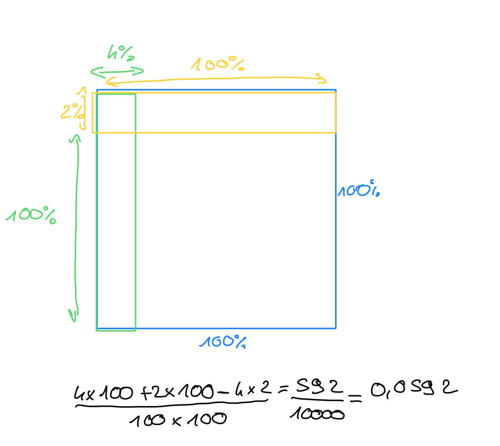
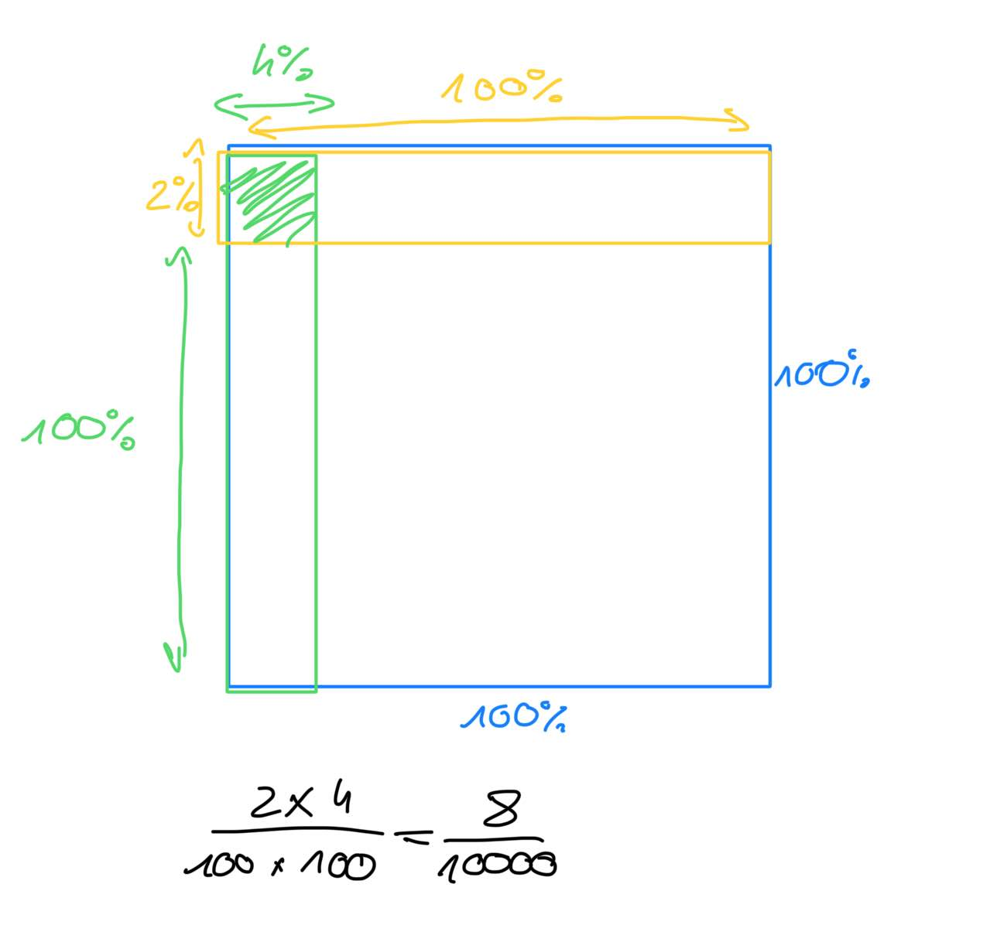

# CC1

## UUID

Quelle programme permmette de visualiser les UUID ?

%

`blkid`, `lsblk -fs`

## Raid

J'ai deux disques, de statistique suivant :

| Stats | Disque A | Disque B |
|-------|----------|----------|
| capacité de stockage | 4 To | 2 To |
| Temps d'accés | 20 ms | 40 ms |
| bande passante | 300 Mo/s | 500 Mo/s |
| % Ban après 2 ans | 2 % | 4 % |

En __Raid 0__ qu'elle sera alors les stats ?

%

| Stats | Raid 0 |
|-------|----------|
| capacité de stockage | 2 To |
| Temps d'accés | 40 ms |
| bande passante | 800 Mo/s |
| % Ban après 2 ans | 0,0592 |

La raison pour le après 2ans :

## Raid

J'ai deux disques, de statistique suivant :

| Stats | Disque A | Disque B |
|-------|----------|----------|
| capacité de stockage | 4 To | 2 To |
| Temps d'accés | 20 ms | 40 ms |
| bande passante | 300 Mo/s | 500 Mo/s |
| % Ban après 2 ans | 2 % | 4 % |

En __Raid 1__ qu'elle sera alors les stats ?

%

| Stats | Raid 1 |
|-------|----------|
| capacité de stockage | 2 To |
| Temps d'accés | 40 ms |
| bande passante | 500 Mo/s |
| % Ban après 2 ans | 0,0008 |

La raison pour le après 2ans :

