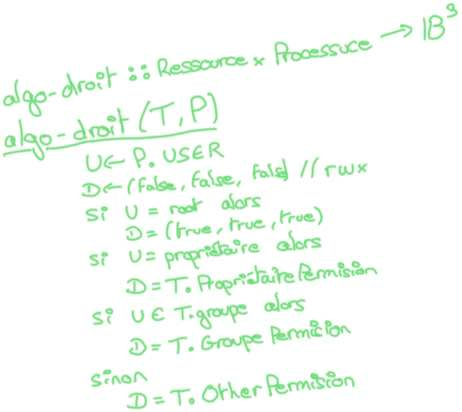
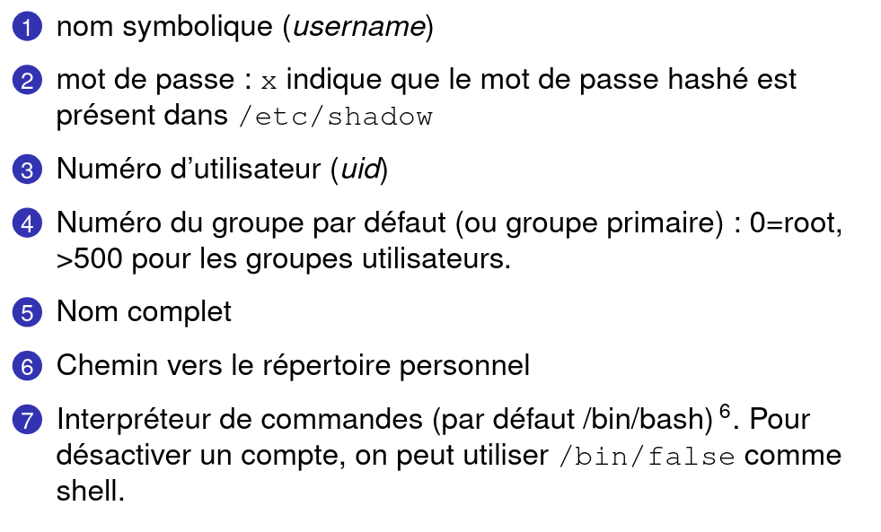
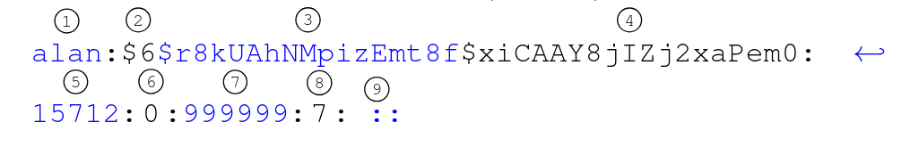
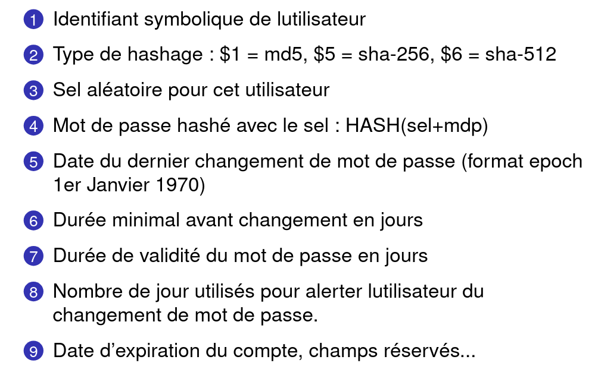

# S5

## Algo

Donner l'algorightme de calcule d'une permision pour une ressource T.

%



## Ressource

A combien de groupe peut t'on associer une ressource ?

%

Un seul.

## User

A combien de groupe un utilisateur peut t'il faire partie ?

%

Autant que nécéssaire.

## Groupe

Qui peut créer des groupes ?

%

Que des adminisateurs peuvent créer des groupes.

## Identification

Comment peut t'on s'identifier sur un système linux ?

%

A l'aide de son username ou bien de sont UID.

## Autentification

Comment peut t'on si'autentifier sur un système linux ?

%

A l'aide de son mot de passe après s'être identifier. 

## File

Donner a quoi correspond les champs par leur numéro


%



## File


Donner a quoi correspond les champs par leur numéro


%



## Identité

Donner une commande qui permet de changer d'identité ?

%

```su <user>```

## Identité 

Donner une commande qui permet de changer l'identité pour un seul lancement de commande ?

%

```sudo -u <user> <cmd>```

## Example

Décrire les étapes de résolution de la commande suivante :
```sudo fdisk -l > /root/liste_des_disques```

%

- Création du fichier /root/liste_des_disques, car > prioritaire. Le propriétaire est le user qui a lancer la cmd.
- execution cmd en sudo

## Mise en situation

Je veux écrire dans un fichier file détenu par root, le résultat d'une comamde, comment puis-je faire ?

%

On doit utiliser la commnade ```tee``` de la sorte : 
```<cmd> | sudo tee file```

## Sudo

Que fais la commande ```sudo``` de son entrée standart ?

%

Elle redirige sont entrée standart vers sa sortie standart.

## Tee

Que fais commande ```tee``` ?

%

Elle redirige sont entrée standart sur le premier fichier qu'elle a en arguement, mais aussi sur sa sortie standart.
