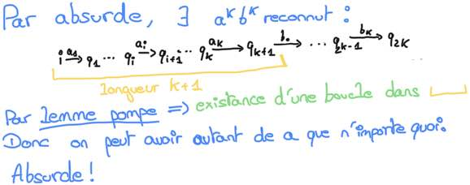

# s1

## Automate a pile

Donner la définition formelle d'un automate a pile.

%

\\(Q, \Sigma, \Gamma, \delta, q_0, Z_0, F\\) avec :
- \\(Q\\) : ensemble finie d'etats
- \\(\Sigma\\) : alphabet d'entrée      
- \\(\Gamma\\) : alphabet de pile
- \\(q_0 \in Q\\) : l'état initial
- \\(Z_0 \in \Gama\\) : symbole de fin de pile
- F états finaux
- \\(\delta \\; : \\; Q*(\Sigma\cup\{\varepsilon\})*\Gamma*Q*\Gamma\\) transitions
  - \\((q, a, A, q', s) \in \delta\\) : 
    Dans l'état \\(q\\), à la lecture de \\(a\\) sur la bande d'entrée
    et avec le symbole \\(A\\) en somme et de pile, passer dans
    l'état \\(q'\\) et remplacer \\(A\\) en sommet de pile par \\(s\\).
  - <u>Rq :</u> epsilon transition autoriser.

## Automate à pile

Donner les deux définition __équivalente__ pour l'acceptation d'une entrée 
\\(w\\) dans un automate a pile.

%

- Condition d'acceptation 1: l'entrée \\(w\\) est acceptée si et seulement il 
existe une lecture de \\(w\\) qui amène dans un état final.

- Condition d'acceptation 2: l'entrée \\(w\\) est acceptée si et seulement si il 
existe une lecture de \\(w\\) qui amène sur une pile vide.

## Représentation delta

Par quoi est représenter \\(\delta\\) quand l'automate est __déterministe__ ?

%

Par une fonction de transition.

## Représentation delta

Par quoi est représenter \\(\delta\\) quand l'automate est 
__pas déterministe__ ?

%

Par une relations de transition.

## Forme normal de Chomsky (FNC)

Donner la forme normal de Chomsky.

%

Une grammaire est de la forme normal de chomsky ssi :
- Toute production est de la forme \\(X \rightarrow YZ\\) ou 
\\(X \rightarrow a\\) ou \\(S \rightarrow \varepsilon\\) avec \\(X,Y,Z \in N\\)
et \\(a \in T\\).

## Forme normale de Greibach (FNG)

Donner la forme d'une grammaire sous forme normal de Greibach.

%

Toute production est de la forme \\(X \rigtharrow aX_1...X_n\\) ou 
\\(X \rightarrow a\\) avec \\(a \in T, X_1,…,X_n \in N\\).

## Lemme de la pompe

Donner l'idée du lemme de la pompe ?

%

Le Lemme de la pompe :
'Si un automate reconnait un mot de longueur + grand que le nombre d'état de 
l'automate \\(\rightarrow\\) y a une boucle dans l'automate, donc un mot plus 
grand existe aussi ect...'.

## \\(a^nb^n\\)

Donner l'idée de la preuve pour montrer que \\(a^nb^n\\) n'est pas un langage 
rationnel.

%

