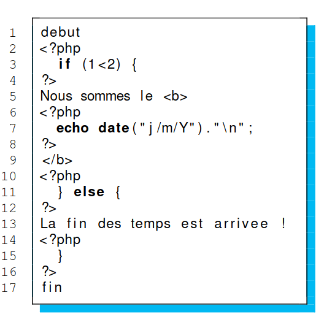
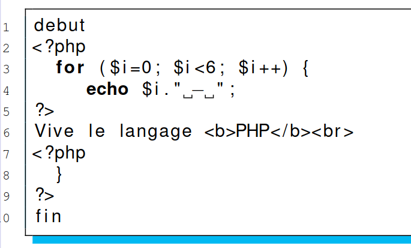
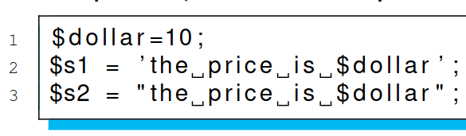
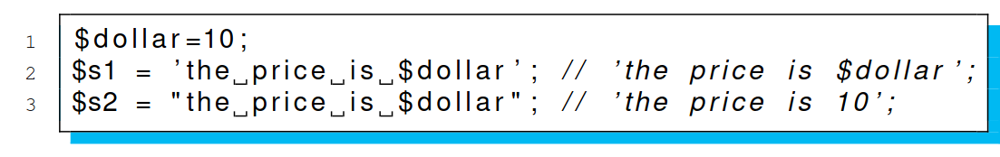
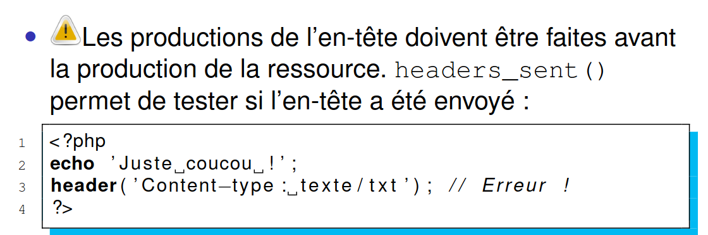

# S10

## PHP

Que veux dire _php_ ?

%

_Hypertext Preprocessor_.

## PHP

Que produit ce code ? Expliquer pourquoi ?



%

Le _PHP_ agit comme une macro de ce faite, le code sera traiter comme si tout 
fesait partie du même bloque <?php?> 

## PHP

Comment est traduit le code suivant en _PHP_ ?



%

```php
debut
<?php
  for ($i=0; $i < 6; $i++) {
    echo $i." - ";
    echo "Vive le langage <b>PHP</b><br>";
  }
?>
```

## PHP

Que faut t'il faire en maximum en codant en _PHP_ ?

%

Il faut réduire au maximum la taille des blocs `<?php?>` en utilisant les 
propritété de macro de _PHP_ au maximum.

## PHP

Que fais ces deux lignes :



%



## PHP

Qu'elle propriété y a t'il sur un les modification de l'entête d'une réponse 
_PHP_ ?

%



## WEB

Que faut t'il absolument faire lorsque un utilisateur s'authentifie après 
avoir déjà obtenu une session web ?

%

Si l'utilisateur disposait d'une session web, alors on regénére les 
identifiants de session a la connection du user (au passage de la session web
vers une session utilisateur).

Faire cela permet de rejeter l'attaque d'injection de cookie.

## web

Qu'appelle t'on sérialisation en web ?

%

Il s'agit de la transformation de l'arbre en page html. Les éléments deviennent 
alors des balies.

## web

Qu'appelle t'on désérialiser en web ?

%

Il s'agit de la transformation d'une page html en arbre.

## Entité 

Qu'est ce qu'une entité ?

%

Il s'agit de l'équivalent d'une macro constante dans le langage de DTD.

## Entité

Comment définir une entité en DTD ?

%

```
<!ENTITY nom "<valeur_1>|<valeur_2>...">
```

## Entité

Comment utilisé une entité en DTD ?

%

`&nom;` remplace alors `&nom;` par la valeur de l'entité.