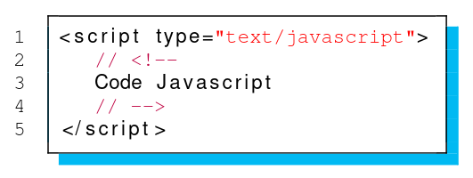

# S5

## JS

Pour qu'elle raison y a t'il les commentaires // <!-- --> dans cette inclusions
de code js ?


%

C'est une sécurité où le parser du html essayerai d'interprété le texte a 
l'intérieur de la balise script.

## JS

Qu'elle balise peut t'on utilisé dans le cas ou le navigateur ne prend pas en 
compte les balises script ?

%

la balise __noscript__ .

## JS 

Qu'elle type de donner peut t'on mettre dans une balise __script__ ?

%

Du CData donc pas de d'intéprétation des caractères HTML.

## JS

Donner les deux moyens d'inclusion de code _JS_ dans un fichier _HTML_ ?

%

1.
\<script type="text/javascript"\>
  code ...
\</ script\>

2.
\<script type="text/javascript" src="source.js"\>

## JS

Que retourne cette fonction ?


%

Elle retourne ```undifined```, a cause du retour a la ligne que le js comprend 
comme un return vide car les point virgules ne sont pas obligatoire dans ce 
code.

## Var vs Let

Donner la différence entre ```var``` et ```let``` ?

%

- Les variables créée avec ```var``` sont hissées (hoisted) :
```js
toto = 5;
var toto;
console.log(toto); // affiche 5
```
Car la déclaration avec ```var``` rend le code équivalent a celui-ci :
```js
var toto;
toto = 5;
console.log(toto); // affiche 5
```
Déclaration en début de block a cause de ```var```.

- ```let``` empèche la redéfinition :
```js
var a = 5; // a = 5
var a; // a=undifined
let a=2; // erreur déjà définie
let b=3 ; // b=3
let b=2; // erreur déjà définie
```

## null vs undifined

En _JS_ qu'elle est la différence entre ```null``` et ```undifined``` ?

%

- ```null``` : signifie l’absence de données dans une variable.
- ```undefined``` : une variable dont le contenu nest pas clair car elle na 
jamais stocké de valeur, pas même null est dite non définie (indéfinie).

## Arguement fonction

En _JS_ qu'elle spécificité y a t'il sur la déclaration des arugments d'une 
fonctions ?

%

- il ne sont pas typé
- La déclaration ne fixe pas le nombre d’arguments :
```js
function calc(x, y) {
  return x + y;
}

console.log(calc(10, 26, 33)); // 26, par d'erreur
console.log(calc(10)); // NAN, pas d'erreur
console.log(calc('a', 'b')); // 'ab", pas d'erreur
console.log(calc('a', 2)); // 'a2', pas d'erreur
```

## Closure

Explquer ce que veut dire le terme __closure__ ?

%

Capture de l’environnement englobant par la fonction interne.

<u>Exemple :</u>

```js
function displayClosure(start) {
  let count = start;
  return function() {
    return count++;
  };
}
```
Va faire vivre l'arguement count a traver de la fonction retourner.

<u>__Attention :__</u> différent de ```static``` en _C_. La ou en _C_ a 
chaque appelle de fonction la variable sera la même ici, a chaque 
'instation' de la fonction sa ne sera pas la même variable count.

## Objet

En _JS_ comment accede t'on a un attribut d'un objet ?

%

Il y a deux syntaxe :
- ```obj.attribue_name```
- ```obj['attribue_name']```

## Objet

Pourquoi dis t'on que les objets _JS_ sont à shéma dynamique ?

%

A cause de cette exemple :
```js
let unRectange = new Rectangle(10, 50); // pas d'attribut couleur
console.log(unRectangle.couleur); // undifined
unRectangle .couleur = "Blue"; // Dispose maintenant d’un attribut couleur
//  Que seule unRectangle dispose, les autres instances de Rectangle ne 
//  l'auront pas.
```

## Methode

Qu'est ce qu'une méthode en _JS_ ?

%

Une méthode est une 'fonction' attachée à un attribut : 
```js
function iam() {
  altert("je suis " + this);
}

let unRectange = new Rectangle(10, 50);

iam(); // Affiche "je suis [object Window]"
unRectangle.whoami=iam; // ajout dynmaique de la méthode whoami a unRectangle
unRectangle.whoami(); // Affhice "je suis [object object]"
```

## Constructeur

Qu'est ce qu'un constructeur en _JS_ ?

%

Il s'agit d'une fonction dont l'appelle est préfixer par ```new```. 

## document.write

Quelle spécificiter y a t'il avec la fonction ```document.write()``` en   
_JS_ ?

%

Tous ce qui sera écrit, sera donc dans le fichier __html__ et sera 
interpréter par le __html__.

## Script JS

Quelle spécificter y a t'il sur un script introduit dans le corps d'un docuement _Html_ ?

%

Le rendering du reste de la page (ce qu'il y a eu dessous de la balise 
script), ne sera 'render' qu'à la fin de l'éxécution de la balise 
```script```.