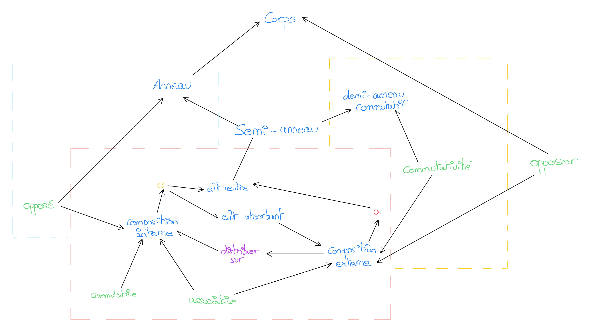

# s1

## Notation

À quoi correspond cette notation \\([x^i]P\\) ?

%

Le coefficient de \\(x^i\\) du polynôme \\(P\\).

## Notation

Donnez la formule du degré d'un polynome \\(P\\) ?

%

\\(deg P = sup\\{i | [x^i]P \neq 0\\}\\)

Attention : \\(sup \neq max \leftarrow deg 0 = -\infty\\)

## Notation

Donnez la valuation du polynome \\(P\\).

%

\\(val P = inf\\{i | [x^i]P \neq 0\\}\\)

Attention : \\(inf \\neq min \\leftarrow val 0 = +\\infty\\)

## elt neutre

Qu'est ce qu'un élément neutre pour une opération \\(+\\) ?

%

\\(e\\) element neutre ssi \\(n + e = e + n = n\\)

## elt absorbant

Qu'est ce qu'un élément absorbant pour une opération \\(*\\) ?

%

\\(a\\) element absorbant ssi \\(n * a = a * n = a\\)

## Associativie

Quand dis t'on qu'une opération est associative ?

%

\\(+\\) associative ssi \\(a + (b + c) = (a + b) + c\\)

## Commutativité

Quand dis t'on qu'une opération est commutative ?

%

\\(+\\) commutative ssi \\(a + b = b + a\\)

## Distribution

Quand dis t'on qu'une opération \\(*\\) est distributive sur \\(+\\) ?

%

\\(a * (b + c) = a * b + a * c\\)

## Mutiplication polynome

Comment écrire la mutiplication d'un polynome sous forme \\([x^i]P\\) par une 
constante \\(\\alpha\\) ?

%

\\([x^i]\\alpha\\times P = \\alpha[x^i]P\\) pour tout \\(i\\).

## Addition polynome

Comment écrire l'addition de deux polynome \\(P, P'\\) sous forme \\([x^i]P\\) ?

%

\\([x^i](P + P') = [x^i]P + [x^i]P'\\) pour tout \\(i\\).

## Multiplication polynome

Comment écrire la multiplication de deux polynome \\(P, P'\\) sous 
forme \\([x^i]P\\) ?

%

\\([x^i](P . P') = \sum_{j + j' = i} ([x^j] P)([x^{j'}]P')\\),
pour le coeff \\(i\\), c'est l'addition des mutilplicaiton de tous 
les monomes tel que leur degré \\(j, j'\\) donne que \\(j + j' = i\\)

Si pas compris, faire un exemple.

## Définiton Inductive

Donner une définition inductive d'un polynôme.

%

- Soit \\(1\\)

- Soit \\(x\\)

- Soit \\(\alpha.P\\) avec \\(\alpha \in \\mathbb{C}\\) et 
\\(P \in \\mathbb{C}[x]\\)

- Soit \\(P + Q\\) avec \\(P, Q \in \\mathbb{C}[X]\\)

- Soit \\(P . Q\\) avec \\(P, Q \in \\mathbb{C}[X]\\)

## Algèbre

Qu'est ce qu'une algèbre ?

%

Un anneau qui est aussi un espace vectoriel.

## Anneau

Qu'est ce qu'un anneau ?

%

C'est un semi-anneau avec la loi de composition interne qui admet un opposé.

## Semi-anneau

Qu'est ce qu'un semi-anneau ?

%

- Un ensemble muni d'une loi de composition interne et externe
- loi interne : commutative, associative, elt neutre \\(e\\), 
elt absorbant \\(a\\)
- loi externe : associative, elt absorbant \\(e\\), 
elt neutre \\(a\\)

## Corps

Qu'est ce qu'un corps ?

%

Un anneau ou la loi de composition externe admet un opposer.

## Espace vectorielle

Qu'est ce qu'un espace vectorielle ?

%

- \\((E, +)\\) un groupe commutatif
- \\(\forall (u, v) \in E, \; \forall (\lambda, \mu) \in \\mathbb{F}\\) :

  - \\(\lambda . (\mu . u) = (\lambda\mu) . u\\)
  - \\(1.u = u\\)
  - \\((\lambda + \mu) . u = \lambda . u + \mu + u\\)
  - \\(\lambda . (u + v) = \lambda . u + \lambda . v\\)

## Exponentiation

A quoi faut t'il faire attention avec l'exponentitation ?

%

\\(0^0\\) n'est pas définie.

## Application linéraire

Qu'est ce qu'une application linéaire ?

%

\\(f : E \to F\\) avec \\(E, F\\) espace vectorielle sur mathbb{k} 
alors \\(x, y \in E\\) et \\(\lambda, \mu \in \\mathbb{k}\\), on a 

\\(f(\lambda x + \mu y) = \lambda f(x) + \mu f(y)\\)

L'application conserve les combinaison linéaire.

## Morphisme d'algèbre

Qu'est ce qu'un morphisme algèbre ?

%

- l'image de \\(1\\) est \\(1\\)
- c'est une application linéaire
- l'image d'un produit est le produit des images

\\(f_{p.p'} = f_p f_{p'}\\)

## Suite géométrique

Donner la définition formelle d'une suite géométrique \\(u_n\\).

%

\\(u_n\\) géométrique ssi :

\\(u_{n + 1} = q \times u_n; u_0 = a\\)

## Forme close suite géométrique

Donner la forme close d'une suite géométrique.

%

\\(u_0\dfrac{1 - q^{n + 1}}{1 - q} (q \neq 1)\\)

## Série géométrique

Qu'est ce qu'une Série géométrique et donner sa forme close.

%

Suite géométrique :

\\(a\sum_{0 \leq k}^{n} q_k = a \dfrac{1 - q^{n + 1}}{1 - q}\\)