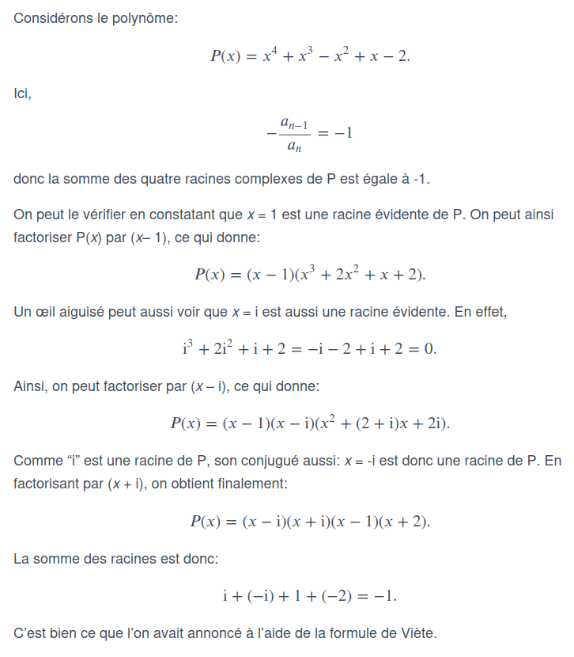

# S4

<<<<<<< HEAD
## Décomposition

Donnez le nombre de décompositions d'un nombre \\(n\\) comme une somme des 
termes inférieure pour \\(n \leq 10\\).

%

| \\(n\\) | Nombre de décompositions |
| :-----: | :-----------:   |
|   1     |    1    | 
|   2     |    2   | 
|   3     |    3    | 
|   4     |    5    | 
|   5     |    7    | 
|   6     |    11   | 
|   7     |    15   | 
|   8     |    22  | 
|   9     |     30   | 
|   10     |     42   | 

## Dériver

Que vaut \\(\lim_{n \to +\infty} x^{n}\\) pour \\(|x| < 1\\) ?

%

\\(\lim_{n \to +\infty} x^{n} = 0\\)

## Polynome

Quelle propriété y a t'il sur le rayon de convergence d'un polynome ?

%

Le rayon de convergence de tout polynome vaut \\(+\infty\\)
=======
## Forme de Viète

Donner la forme de Viète d'un polynôme est à quoi elle sert.

%

Soit un polynome \\(P = \sum_{k = 0}^{n} \alpha_k x^k\\) et ces racines complexe
\\(r_0, \cdots, r_n\\), on a que \\(\sum_{i = 0}^{n} r_i = - \dfrac{a_{n - 1}}{a_n}\\)

Cela permet de faire quelque chose de la sorte :

## Fonction génératrice ordinaire

Donnner la __fonction génératrice ordinaire__ associer a la suite 
\\((u_n)_{n \in \mathbb{N}}\\).

%

\\(S_{u}^{ord} = \sum_{n \geq 0} u_n x^n\\)

## Fonction génératrice exponentielle

Donner la __serie génératrice exponentielle__ associer a la suite 
\\((u_n)_{n \in \mathbb{N}}\\) et quelle est sont intérer par rapport à une
__série génératrice ordinaire__.

%

\\(S_{u}^{exp} = \sum_{n \geq 0} \dfrac{u_n}{n!} x^n\\)

Sont intérer est si on arrive pas a quantifier par une fonction on peut alors 
diviser par \\(n!\\) la suite ce qui permet de mieux quantifier la série.

## Suite récurente linéaire

Donner une forme générale pour la __série génératrcie ordinaire__ pour la suite
\\(a_n\\) définie de la façon suivante :

\\(
\begin{cases}
  a_0, & \text{fixée}\\
  \cdots, & \text{fixée} \\
  a_{k-1} & \text{fixée}\\
  a_n = \alpha_1 a_{n - 1} + \ldots + \alpha_k a_{n - k} & \text{ pour } n \geq k\\ 
\end{cases}  
\\)

%

\\(
S_a^{ord} = \dfrac{\sum_{n = 0}^{k - 1} (a_n - \sum_{j = 0}^{n - 1} \alpha_{n - j} a_j) x^n}{1 - \sum_{n = 1}^k \alpha_n x^n}  
\\)

## Dérivier racine

Donner la dériver de la fonction \\(\sqrt(x)\\).

%

\\(\dfrac{d}{dx}(\sqrt(x)) = \dfrac{1}{2\sqrt(x)}\\)

## Dérivier logarighme

Donner la dérivier de la fonction \\(\ln x\\)

%

\\(\dfrac{d}{dx}(\ln(x)) = \dfrac{1}{x}\\)

## Dérivier exponentielle

Donner la dérivie de la fonction \\(e^x\\)

%

\\(\dfrac{d}{dx}(e^x) = e^x\\)

## Dériver sin

Donner la dérivé de la fonction \\(\sin x\\)

%

\\(\dfrac{d}{dx}(\sin x) = \cos x\\)

## Dériver cos

Donner la dérivie de la fonction \\(\cos x\\)

%

\\(\dfrac{d}{dx}(\cos x) = -\sin x\\)

## Propriété trigo

Que vaut \\(\cos(-x)\\) ?

%

\\(\cos(-x) = \cos(x)\\)

## Propriété trigo

Que vaut \\(\sin(-x)\\) ?

%

\\(\sin(-x) = -\sin(x)\\)

## Propriété trigo

Que vaut \\(\cos^2(t) + \sin^2(t)\\)

%

\\(\cos^2(t) + \sin^2(t) = 1\\)

## Propriété d'addition

Que vaut \\(\cos(a + b)\\) ?

%

\\(\cos(a + b) = \cos(a)\cos(b) - \sin(a)\sin(b)\\)

## Propriété d'addition

Que vaut \\(\cos(a - b)\\) ?

%

\\(\cos(a - b) = \cos(a)\cos(b) + \sin(a)\sin(b)\\)

## Propriété d'addition

Que vaut \\(\sin(a + b)\\) ?

%

\\(\sin(a + b) = \sin(a)\cos(b) + \cos(a)\sin(b)\\)

## Propriété d'addition

Que vaut \\(\sin(a - b)\\) ?

%

\\(\sin(a - b) = \sin(a)\cos(b) - \cos(a)\sin(b)\\)
>>>>>>> 428aec2 (ajout)
