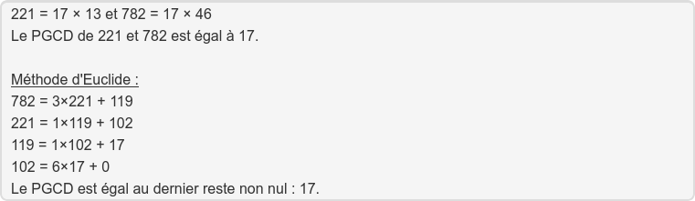
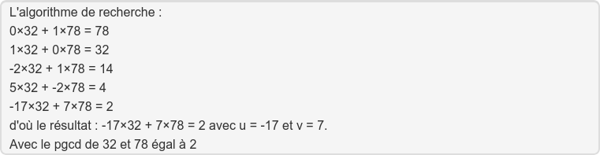
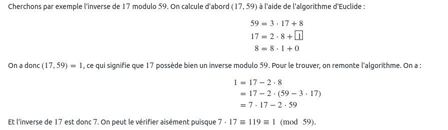

# S4

## PGCD

Calculer le pgcd entre 221 et 782 ?

%

## coeff de bezout

Donner les coeffs de bezout de 32 et 78 ?

%

## Inverse modulaire

Comment calculer l'inverse modulaire de 17 modulo 59

%

