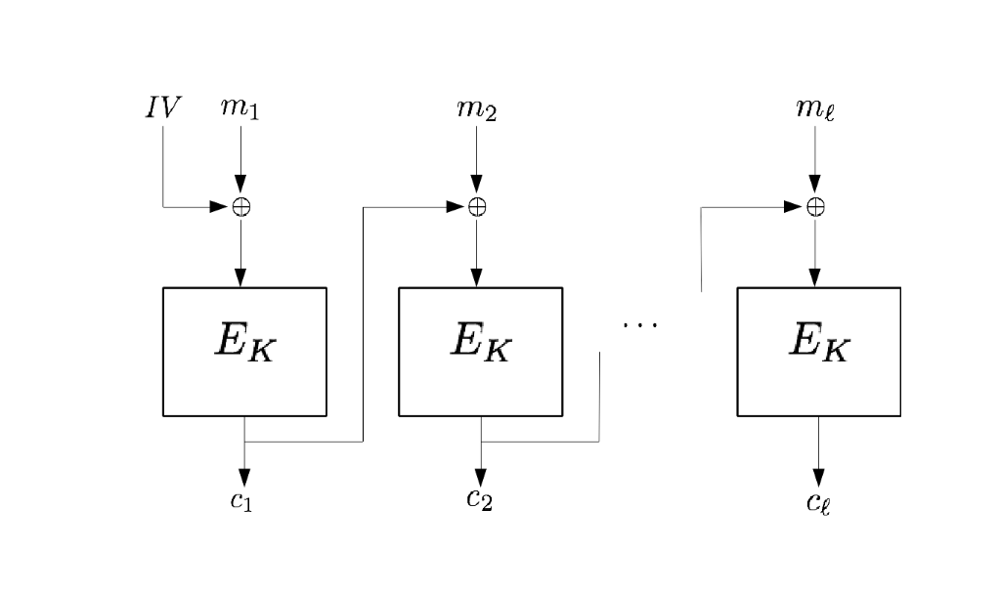
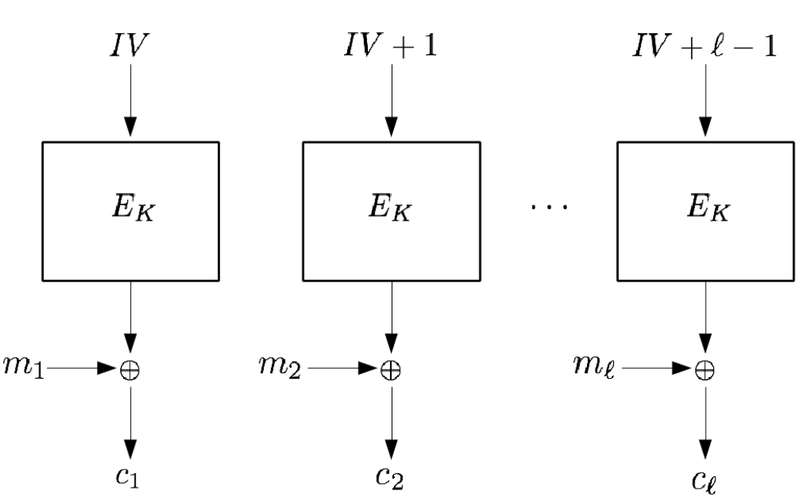

# S6

## Inconvéniant RSA

Donner les inconvéniant du RSA.

%

- Il est lent
- les messages doivent être plus petit que \\(N\\). Car on travaille modulo
\\(N\\) et c'est le représentant du message que l'on prendrait si jamais la 
taille de notre message était plus grande que celle de \\(N\\).

## Chiffrement Symétrique

Donner les deux techniques de chiffrement **symétrique**.

%

Chiffrement par :
- **flot :** l'algo de chiffrement n'a pas de taille prédéfinie pour chiffrer,
déchiffrer. On créer des chiffrer au moins de la taille du texte, voir plus 
grand.
- **bloc :** On découpe notre claire en plusieur bloc et on *fusion* c'est 
bloque pour obtenir la chiffrement final (ex: **Feistel**).

## Chiffrement symétrique

Donner trois méthode de chiffrement par bloc.

%

- **ECB :** Division en bloc de taille accépter par le chiffrement puis on 
envoie la version concaténer du chiffré (on peut rajouter des choses a la fin
pour combler).
- **CBC :** 
 
- **CTR :**

## Diffusion

En quoi consiste la **diffusion** en cryptographie ?

%

Il s'agit d'une propriété qui dis que si on change même qu'un seul bit du claire
alors le chiffré sera vraiment distinct du précédent.

## Confusion

En quoi consiste la **confusion** en cryptographie ?

%

Il s'agit d'une étape qui casse complétement le lien entre claire et chiffré.

