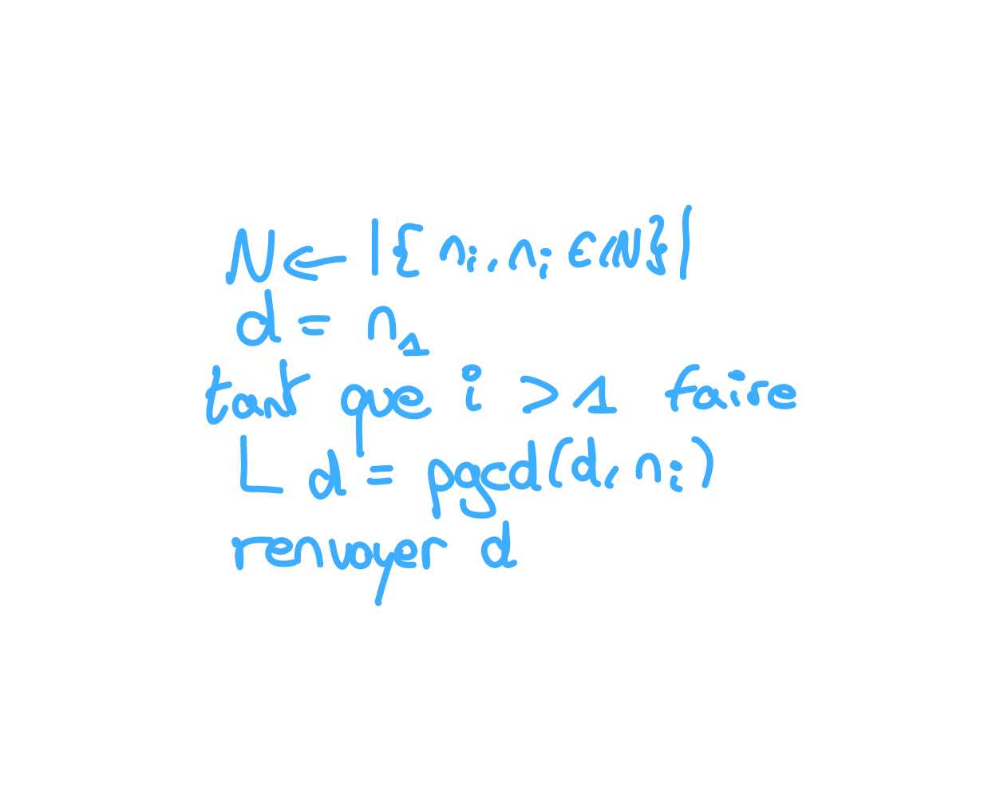

# S7

## Algèbre

A quoi correspond \\((\mathbb{Z}/N\mathbb{Z})^{\times}\\) ?

%

- l'ensemble des nombres premiers avec \\(N\\).
- l'ensemble des nombres inversibles de \\(\mathbb{Z}/N\mathbb{Z}\\)

## Relation

Quand dis t'on que \\(R\\) est une **relation d'odre** ?

%

- \\(R\\) **réflexive**, \\(\forall x, x R x\\)
- \\(R\\) **antisimétrique**, si \\(x R y\\) et \\(y R x\\) alors \\(x = y\\)
- \\(R\\) **transitive**, si \\(x R y\\) et \\(y R z\\) alors \\(x R z\\)

## Relation binaire

Qu'est ce qu'une **relation binaire** ?

%

Soit **relation binaire** de \\(E \to F\\), est une partie \\(G\\) de 
\\(E\times F\\) tel que \\((x, y) \in G \Rightarrow x R y\\).

## Ordre total

Quand dis t'on qu'un ordre est **total** ?

%

Un ordre \\(R\\) est **total** ssi \\(\forall x, y, x R y \lor y R x\\)

## Ordre partille

Quand dis t'on qu'un ordre est **partielle** ?

%

un ordre est partiel lorsqu'il n'est pas total.

## Relation d'équivalence

Quand dis t'on qu'une relation est une **relation d'équivalence** ?

%

- **réfléxive**, \\(\forall x, x R x\\)
- **symétrique**, \\(\forall x, y\\), si \\(x R y\\) alors \\(y R x\\)
- **transitive**, si \\(x R y\\) et \\(y R z\\) alors \\(x R z\\)

## PGDC

Comment avoir le pgcd d'un ensemble d'entier \\(\{n_i, n_i \in \mathbb{N}\}\\)

%

## Anneau

Donner la définition d'un anneau selon un groupe.

%

\\((A, +, \times)\\) est un anneau ssi :
- \\((A, +)\\) est un groupe commutatif
- \\(\times\\) est associative
- \\(\times\\) est distributive par rapport à l'addition

## Anneau unitaitre

Quand dis t'on qu'un anneau est unitaire

%

Un anneau est unitaire ssi \\(\times\\) admet un élément neutre.

## Sous groupe

Qu'est ce qu'un sous groupe ?

%

Un sous groupe est un sous ensemble d'un groupe qui est lui même un groupe.

## Condition d'équivalence

Donner une condition nécéssaire et suffisante pour qu'un sous ensemble \\(H\\)
d'un groupe soit un sous groupe ?

%

- \\(H\\) contient l'élément neutre
- \\(\forall x, y \in H, xy^{-1} \in H\\)

## Ideal

Qu'est ce qu'un idéal ?

%

Soit \\((A, +, \times)\\) un anneau et \\(I\\) une sous de \\(A\\), c'est un 
idéal ssi :
- \\((I, +)\\) est un sous groupe de \\((A, +)\\)
- \\(\forall x \in I, \forall a \in A, ax, xa \in I\\)

## Morphisme d'anneau

Qu'est ce qu'un morhpisme d'anneau ?

%

Une fonction entre deux anneau \\(f\\) est un morphisme ssi :

- \\(f(x + y) = f(x) + f(y)\\)
- \\(f(xy) = f(x)f(y)\\)

## Nombre premier 

De manière informelle, pour un rang \\(n\\) combien y a t'il de nombre premier 
jusqu'à \\(n\\) ?

%

Environ \\(\dfrac{1}{\ln{n}}\\)

## Résidu quadratique

Qu'est ce qu'un résidu quadratique ?

%

Un entier \\(x\\) est un résidu quadratique modulo \\(p\\), s’il existe un 
entier \\(y\\) tel que \\(0 < y < p\\) et \\(y^2 = x \mod p\\).
L’entier \\(y\\) est alors une racine carrée de \\(x modulo p\\).