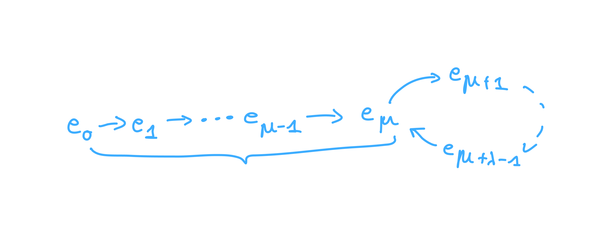
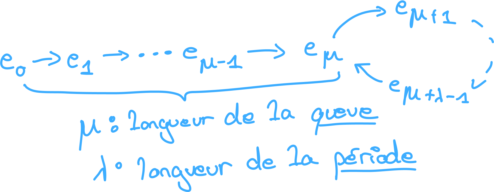

# s8

## Diviseur de zero

Dans un Anneau qu'est ce qu'un diviseur de 0 ?

%

Un élément \\(a\\) non nul d'un anneau est un **diviseur de zero** ssi il existe
un autre élément \\(b\\) non nul tel que \\(ab = 0\\).

## Anneau intègre

Qu'est ce qu'un anneau intègre ?

%

Soit \\(A\\) un anneau commutatif, tel qu'il est différent de \\(\{0\}\\) et
qu'il ne possède pas de **diviseur de zero** alors il est intègre.

## Polynome unitaire

Qu'est ce qu'un polynome unitaire ?

%

C'est un polynome tel que sont coeff de plus haut degré vaut 1.

## Chiffrement de verman

Qu'appelle-t-on chiffrement de *verman* ?

%

C'est le one time pad

## PRG

Qu'est ce qu'un **PRG** et donner c'est propriété.

%

un **PRG**, **pseudo random generator** est un algo de génération de nombre 
de façon pseudo aléatoire. Ces propriétés sont les suivantes :
- Algo déterministe pour créer l'aléa
- sortie en partie déterminer par la graine
- la sortie doit ressembler à un flux aléatoire
- l'algo doit être rapide
- la sortie ne doit pas être prédictible

## PRG, IV

Dans un PRG qu'appelle t'on IV ?

%

l'IV correspond au vecteur d'initialisation de l'algo de génération de nombre
aléatoire. Cette IV doit donc être changé régulièrement.

## Graphe fonctionelle 

Qu'est-ce qu'un **graphe fonctionnel** ?

%

Soit une fonction \\(f : A \to A\\) le graphe fonctionnel de \\(f\\), 
correspond au graphe tel que chaque arrête (graphe orienté) est de la forme
\\((a, f(a))\\). De plus, \\(|A|\\) doit être finie.

## Suite infinie, ensemble finie

Donner la représentation dans le cas général, la représentation d'un **graphe 
fonctionnelle** d'une suite infinie \\((e_n)_{\forall n \in \mathbb{N}}\\) dans 
un ensemble finie.

%

## Suite infinie, ensemble finie

Comemnent califie t'on une suite qui est infinie dans un ensemble finie ?

%

Il s'agit d'une suite **ultimement périodique**.

## Suite infinie, ensemble finie

Qu'est ce que la longueur de la queu et la période pour une suite **ultimement
prériodique** ?

%

## Suite périodique

Qu'est ce qu'une suite **périodique** ?

%

On califie de suite périodique, une suite telle que la longeur de sa queu est 
égal à zero. Le pointe de départ de la période de la suite et le point de départ
de la suite.

