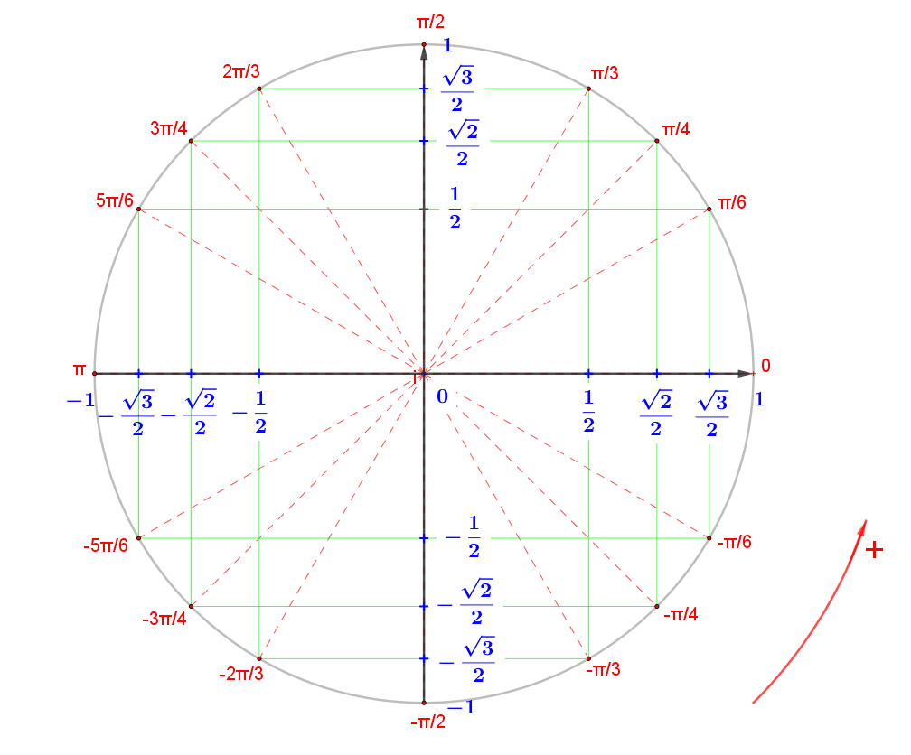
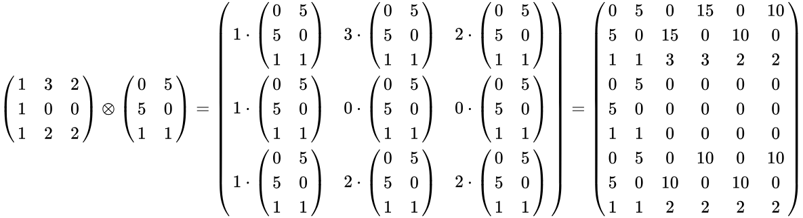
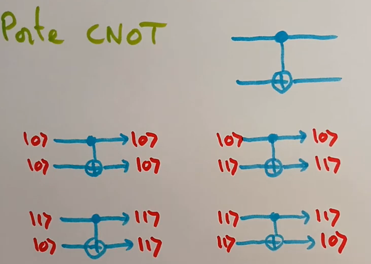
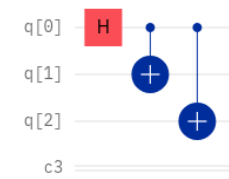
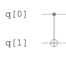

# S1

## Cercle trigonométrique

Donner à quoi corresponde les axes du cercle trigonométrique 
(abside, ordonner).

%

## Résultat trivial cercle trigonométrique

Que vaut \\(cos(\pi) \text{ et } sin(\pi)\\) ?

%

## Propriété quantique

Quelles sont les propriétés principales de la physique quantique nécessaires
à la réalisation d'ordinateurs quantiques ? Expliquer brièvement en quoi ces
propriétés n'ont pas d'équivalent dans le cadre de la physique classique.

%

**Propriété quantique**
- **Superposition** : Permet à un système quantique d'être dans plusieurs 
  états simultanément (position, niveau d'énergie, polarisation, etc.).  
- **Cohérence** : Essentielle pour maintenir la superposition d'états; la 
  perte de cohérence se produit lors d'interactions avec l'environnement.  
- **Intrication** : Certaines propriétés quantiques se retrouvent de manière 
corrélée sur plusieurs particules, quelle que soit la distance qui les sépare.

## Einsteine erreur

Dans une lettre à Max Born en 1926, Einstein exprimait son scepticisme envers 
l'approche probabiliste de la mécanique quantique. Comment interprétez-vous 
cette citation dans le cadre du développement de la physique quantique ?

%

Einstein reconnaît l'importance des avancées théoriques et des résultats de la 
mécanique quantique, mais il rejette son interprétation orthodoxe probabiliste. 
Pour lui, cette approche reflète notre ignorance fondamentale de la physique 
quantique, ignorance qui sera un jour levée par une théorie ultérieure. Ainsi, 
il pose les bases de ses futures objections, qu'il exprimera via le concept de 
« variables cachées » (paradoxe EPR).

## conjuguer

A quoi est égal \\(\overline{\bra{\alpha}n\ket{\beta}}\\) ?

%

\\(\overline{\bra{\alpha}n\ket{\beta}} = \bra{\alpha}^\dagger n \ket{\beta}^\dagger\\)

## matrice, qbit

Donner la matrice associer au *qbit* : \\(\ket{0}\\)

%

\\(\ket{0} = \begin{pmatrix}
1 \\
0
\end{pmatrix}\\)

## matrice, qbit

Donner la matrice associer au *qbit* : \\(\ket{1}\\)

%

\\(\ket{1} = \begin{pmatrix}
0 \\
1
\end{pmatrix}\\)

## Etat

Quelle particularité y a-t-il sur les états \\(e^{i \theta}\ket{\phi}\\) et 
\\(\ket{\phi}\\) ?

%

Ils sont physiquement indistinguables

## Produit de Kronecker

Que représente le produit de Kronecker entre une matrice A et B ?

%

## C-not

Dire ce que fait l'opérateur \\(c-not_{0 \mapsto 1} = c-not\\).

%

Cela reviens a faire un xor entre le qbit 0 et le 1 et a mettre le résultat 
dans le qbit 1.

## C-not

Que signifie cette notation \\(c-not_{0 \mapsto 2}\\) ?

%

Que c'est le bit 0 qui *controle* et que le bit 2 est celui *controler*.
On met donc le résultat du xor entre les deux dans le bit 2.

## Norme

Qu'est ce que la norme d'un qbit 
\\(\ket{\phi} = \alpha\ket{0} + \beta\ket{1}\\) ?

%

Il s'agit de \\(|\alpha|^2 + |\beta|^2\\)

## Normaliser

Que signifie *normaliser* un qbit ?

%

Un qbit n'est pas normaliser si sa norme n'est pas égal a 1.
Pour *normaliser* un qbit qui ne l'est pas, il suffit décrire :

\\(\dfrac{\ket{\phi}}{\sqrt{Norme(\phi)}}\\)

## Mesure précondition

Qu'elle précondition existe t'il pour pouvoir mesurer un qbit ?

%

Il faut que le qbit soit de norme 1.

## circuit

Ecrire ce circuit sous forme d'opérateur.

%

\\(c-not{0 \mapsto 2}c-not{0 \mapsto 1}H_0\\)

## C-not circuit

Comment écris t'on ce cricuit sous forme d'opérateur \\(c-not\\) ?

%

\\(c-not_{0 \mapsto 1}\\)

## Moins 1

Soit un opérateur quantique \\(C\\) que vaut \\(C^{-1}\\) ?

%

\\(C^{-1} = C^\dagger\\)

## Daggue

Que vaut \\((AB)^\dagger\\) ?

%

\\((AB)^\dagger = B^\dagger A^\dagger\\)

## UU = I

Que déduit'on d'un opératuer \\(U\\) tel que \\(UU = I\\).

%

Alors \\(U^{-1} = U^\dagger = U\\) par définition de l'inverse.

## Lecture qbit

Qu'elle différence y a t'il entre la façon dont les informaticien lise les qbit
et celle des physiciens ?

%

En informatique quantique \\(\ket{a_n, \cdots, a_0}\\) en physique c'est 
\\(\ket{a_0, \cdots, a_n}\\)

## Produit scalaire Herminitien

Donner les propriétés du produit  scalaire Herminition

%

- *Linéaire a droite*
  \\(\bra{\psi}\ket{\alpha\phi + \beta\phi'} = \alpha\bra{\psi}\ket{\phi} + \beta\bra{\psi}\ket{\phi'}\\)

- *Sesquilinéaire a gauche*

  \\(\bra{\alpha\psi + \beta\psi'}\ket{\phi} = \overline{\alpha}\bra{\psi}\ket{\phi} +  \overline{\beta}\bra{\psi'}\ket{\phi}\\)

- *Définie positive*

  \\(\bra{\psi}\ket{\psi} > 0\\)

\\(|\bra{\psi}|^2 = |\ket{\psi}|^2 = \bra{\psi}\ket{\psi}\\)

## Transformation bras-ket en matrice

Comment transformer la notation bras, ket en matrice ?

%

La notation bras (\\(\bra{\psi}\\)) correspond à une matrice ligne et la notation 
ket (\\(\ket{\psi}\\)) à une matrice colonne. 

## bras-ket vers matrice

Par quelle matrice peut t'on représenter \\(\ket{i_{n - 1}, \cdtos, i_0}\bra{j_{n - 1}, \cdots, j_0}\\) ?

%

La matrice est : représenter comme la matrice carrer ayant
des 0 partout sauf a la coordonée 
\\(i_{n - 1}, \cdtos, i_0,\; j_{n - 1}, \cdots, j_0\\) a laquel elle a 1.

## Produit tensorielle

Que vaut \\(\bra{\psi_1\psi_2}\ket{\phi_1\phi_2}\\) ?

%

\\(\bra{\psi_1\psi_2}\ket{\phi_1\phi_2} = (\bra{\psi_1}\otimes\bra{\psi_2})(\ket{\phi_1}\otimes\ket{\phi_2})
 = \bra{\psi_1}\ket{\phi_1}\bra{\psi_2}\ket{\phi_2}\\)

## Produit tensorielle

Que vaut \\(\ket{\psi_1}\bra{\phi_1} \otimes \ket{\psi_2}\bra{\phi_2}\\)

%

\\(\ket{\psi_1}\bra{\phi_1} \otimes \ket{\psi_2}\bra{\phi_2} = (\ket{\psi_1}\otimes\ket{\psi_2})(\bra{\phi_1}\otimes
\bra{\phi_2}) = \ket{\psi_1\psi_2}\bra{\phi_1\phi_2}\\)

