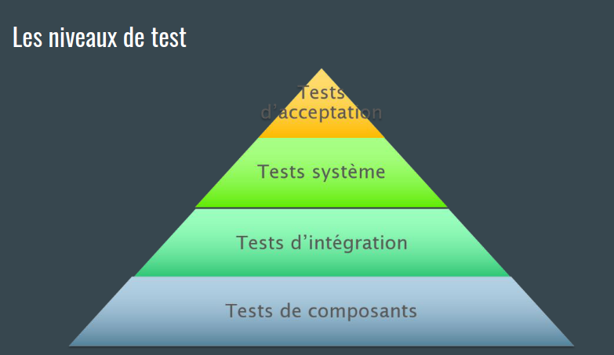
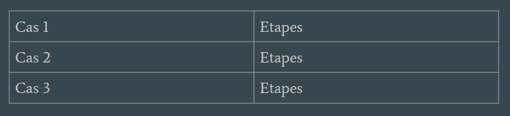
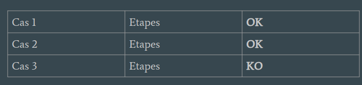

# S1

## Terme test

Que signifie l'acronime **QA** ?

%

Il s'agit de l'assurance qualité d'un produit. 
désigne tout processus systématique visant à vérifier qu'un produit ou un 
service en cours de développement est conforme à des exigences précises.

## Terme test

Que singifie l'acronime **ISTQB** ?

%

International Software Testing Qualifications Board, il s'agit du
commité internaitonal de test logiciel.

## Test fonctionnels

Qu'est ce qu'une **test fonctionnels** ?

%

garantir :
- exactitude
- complétude
- aptitude à l'usage

## Test performance

Qu'est ce qu'un **test de performance** ?

%

Tester :
- le temps de réponse
- utilisation de ressource
- capacité

## Test compatibilité

Qu'est ce qu'un **test de compatibilité** ?

%

- Coexistence
- interopérabilité

## Test D'utilisatbilité

Qu'est ce qu'un **test d'utilisabilité** ?

%

- intélligibilité
- apprentissage
- opérabilité
- ergonomie
- accessibilité

## Niveau de test

Donner les niveaux de test :

%

Test Composant = test Unitaire

## Test unitaire

Qu'est ce qu'une **test unitaire** ?

%

Tester la plus petite portion de code possible

## Test d'intégration

Qu'est ce qu'un **test intégration** ?

%

Test bout en bout afin de vérifier que les briques logicielles
sont compatibles entre elles

## Test de composant

Qu'est ce qu'un test de composant ?

%

C'est un test unitaire

## Test système

Qu'est ce qu'un test système ?

%

C'est un test fonctionnel et non fonctionnel appliqué au système 
entier (environnement de test) afin de s'assurer qu'il est opérationel.

## Test d'acceptation

Qu'est ce qu'un test d'acceptation ?

%

Ou user acceptance testing en anglais, c'est la confrontation
aux utilisateurs, la mise en conditions réelles.

## QCM

Qu’est-ce qui définit le mieux un test ?

%

Un ensemble de conditions
préalables, de données d'entrée, d'actions (le cas
échéant), de résultats attendus et de postconditions,
élaboré sur la base des conditions de test.

## QCM

Qu’est-ce qu’un test de régression ?

%

Tests d’un programme
préalablement testé, après une modification, pour
s’assurer que des défauts n’ont pas été introduits ou
découverts dans des parties non modifiées du logiciel,
comme suites des modifications effectuées.

## principie du test

Donner les principe du test ?

%

1. Les tests montrent la présence de défauts, pas leur absence
2. Les tests exhaustifs sont impossibles
3. Tester tôt économise du temps et de l’argent
4. Regroupement des défauts : 
  Un petit nombre de modules contient généralement la plupart des défauts découverts
  lors des tests avant livraison, ou est responsable de la plupart des défaillances en
  exploitation
5. Paradoxe du pesticide :
  Un petit nombre de modules contient généralement la plupart des défauts découverts
6. Les tests dépendent du contexte
7. L’absence d’erreurs est une illusion

## Test statique

Qu'est ce qu'un test statique ?

%

Il s'agit d'un test qui ne nécessitent pas d'exécuter du code

## Test dynamique 

Qu'est ce qu'un test dynamique ?

%

Tests qui nécessitent d’exécuter le code.

## Revue formelle

Qu'est ce qu'une revue formelle de documentation ?

%

Une forme de revue qui suit un processus défini avec une documentation 
formelle des résultats.

## Revue informelle

Qu'est ce qu'une revue informelle ?

%

Un type de revue qui n’est pas basée sur une procédure formelle (documentée)

## test unitaire ?

Qu'est ce qu'un test unitaire ?

%

Tester la plus petite portion de code possible de
manière isolée. Le test unitaire doit être :

- isolé
- atomique
- répétable
- lisible

## Mocks

Qu'est ce qu'un **mocks** ?

%

Il s'agit du **bouchon stupide**. une implémentation spéciale ou
squelettique d’un composant logiciel, utilisé pour
développer ou tester un composant qui l’appelle ou en
est dépendant

## Les pilotes ou drivers

Qu'est ce qu'un Les pilotes ou drivers ?

%

Définition ISTQB : un composant logiciel ou outil de
tests qui remplace un composant qui contrôle et/ou
appelle un composant ou système

Les pilotes ou drivers
Traduction : Un composant programmé
spécifiquement pour le test qui va vous renvoyer un
clone idiot configuré ou des données adaptées

## Test système 

Qu'est ce qu'un test système ?

%

Le test système se réalise sur système intégré,
autrement dit un environnement de test complet. Il
permet de vérifier la conformité de l’application par
rapport aux exigences

## Test d’acceptation / User acceptance testing

Qu'est ce qu'un Test d’acceptation / User acceptance testing ?

%

Test d’acceptation : test formel en rapport avec les
besoins utilisateur, exigences et processus métier,
réalisé pour déterminer si un système satisfait ou non
aux critères d’acceptation et permettre aux
utilisateurs, clients ou autres entités autorisées de
déterminer l’acceptation ou non du système.

## Boite blanche

Qu'est ce qu'un test en boite blanche ?

%

On a accés au code on le connais.

## Boit noire

Qu'est ce qu'un test en boite noire ?

%

On ne connait pas le code / pas accés

## Boite grise

Qu'est ce qu'un test en boite grise ?

%

Il s'agit d'un test qui a ces infos :

- Schéma d’architecture
- Description des protocoles d’échange de données
- Exemples de payloads

## Test alpha

Qu'est ce qu'un test alpha ?

%

Alpha : Utilisateurs en interne, possiblement
dans d’autres services.

## Test Beta

Qu'est ce qu'un test beta ?

%

Beta: Utilisateurs externes, vos clients.

## BDD

Qu'est ce que BDD ?

%

Behavior Driven Development, le 
- GIVEN
- WHEN
- THEN

## TDD

Qu'est ce que le TDD ?

%

- Ecrire un test unitaire
- Exécuter le test échoue
- Ecrire le code qui correspond
- Jusqu’à ce que le test passe
- Refactorer le code

## ATDD

Qu'est ce que le ATDD ?

%

- Ecrire un test d’acceptation en échec
- Appliquer le TDD
- Jusqu’à ce que le test d’acceptation passe
- Refactorer

## Pyramide

Quelle particularité y a t'il sur la pyramide de test ?

%

Tous les tests dans la pyramide sont des test dynamique.

## Document test

Qu'est ce qu'une politique de test ?

%

Document de haut niveau décrivant les principes, approches et
objectifs majeurs de l’organisation concernant l’activité de test.

Décrit les éléments suivants :
- objectifs
- niveau a atteindre
- les moyens mis en oeuvre
- les raisons

## Docuemnt test

Qu'est ce qu'une Stratégie de test ?

%

Document de haut niveau définissant, pour un programme, les
niveaux de tests à exécuter et les tests dans chacun de ces niveaux (pour un ou
plusieurs projets)

- Document haut niveau écrit à partir de la
politique de test.
- Niveau organisationnel ou d’un programme.
- Donne le contexte pour un projet

## Document test

Qu'est ce qu'un Plan de tests ?

%

Document décrivant l’étendue, l’approche, les ressources et le planning
des activités de test prévues. Il identifie entre autres les éléments et caractéristiques
à tester, l’affectation des tâches, le degré d’indépendance des testeurs,
l’environnement de test, les techniques de conception des tests et les techniques de
mesure des tests à utiliser ainsi que tout risque nécessitant la planification de
contingence. Il constitue la documentation du processus de planification de 
test.

Un plan de test définit donc ce que l’on va tester, comment on va le tester mais
aussi ce qui ne va pas être testé.

## Document test

Qu'est ce qu'un cas de tests ?

%

Un ensemble de conditions préalables, de données d'entrée,
d'actions (le cas échéant), de résultats attendus et de postconditions, élaboré
sur la base des conditions de test.

## Document test

Qu'est ce qu'une étape de test ?

%

Une action décrite précisément pour pouvoir être reproduite

## Document test

Qu'est ce qu'une suite de test ?

%

Ensemble de cas de test ou de procédures de test à exécuter dans un
cycle de test spécifique

## Campagne test

Qu'est ce qu'une campagne de test ?

%

Une campagne de test est un ensemble de cas de tests à exécuter sur une période
donnée. Le résultat de ces exécutions est alors synthétisé dans un bilan.

Une campagne de test est un ensemble de cas de tests à exécuter sur une période
donnée. Le résultat de ces exécutions est alors synthétisé dans un bilan.

## Matrce d'exécution des test

qu'est ce qu'une Matrce d'exécution des test ?

%

## Couverture

Qu'est ce que la couverture ?

%

le degré, **exprimé en pourcentage**, selon lequel un élément de
couverture spécifié a été exécuté lors d’une suite de test.

## couverture de code

Qu'est ce que la couverture de code ?

%

une méthode d’analyse qui détermine quelles parties du
logiciel ont été exécutées (couvertes) par une suite de tests et quelles parties ne
l’ont pas été, p.ex. couverture des instructions, des décisions ou des conditions

## couverture de méthodes

Qu'est que la couverture de méthodes ?

%

une méthode d’analyse qui détermine quelles parties du
logiciel ont été exécutées (couvertes) par une suite de tests et quelles parties ne
l’ont pas été, p.ex. couverture des instructions, des décisions ou des conditions

## La couverture d’instructions

Qu'est ce que La couverture d’instructions ?

%

le pourcentage des instructions exécutables qui ont
été exécutées par une suite de tests.

## couverture des chemins ou de décisions

Qu'est ce que la couverture des résultats des décisions ?

%

La couverture des résultats des décisions

## politique de test

Qui définie la politique de test ?

%

l'entreprise

## stratégie de test

Qui définie la stratégie de test ?

%

l'entreprise

## stratégie de test

Qui définie la stratégie de test ?

%

c’est au test manager de la définir, parfois en collaboration

## QCM

La différence entre une suite de test et une matrice
d’exécution des tests ?

%

Le statut d’exécution

## QCM

Comment calcule t'on la criticité ?

%

A partir de la probabilité et de l’impact

## analyse des risques

Donner les facteur de risque :

%

- Facteur business
- Facteur projet
- Facteur qualité
- Facteur environnemental

## Risk Based Testing

Qu'est ce que le Risk Based Testing ?

%

Le « risk based testing » utilise les risques, soit la probabilité d’apparition d’un bug,
pour prioriser et adapter les tests à exécuter lors d’une campagne. Chaque bug est
ainsi associé à une criticité. Plus la criticité est forte, plus l’impact sera grand voire
bloquant, pour l’utilisation de l’application ou du site à tester.

## MC/DC

Qu'est ce que le MC/DC ?

%

La modified condition / decision coverage (MC/DC - couverture des conditions
modifiées / décisions)
- Condition : Une condition est une expression booléenne atomique (ne contenant
pas d'opérateur booléen).
- Décision : Une décision est une expression booléenne composée de Conditions et
éventuellement d'opérateurs booléens. Une décision sans opérateur booléen est
aussi une condition