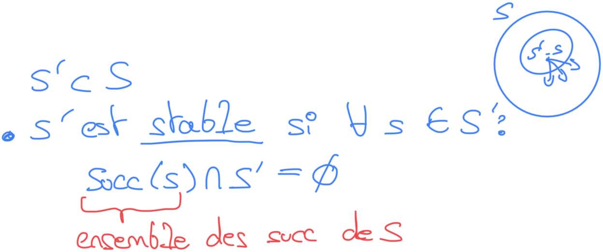
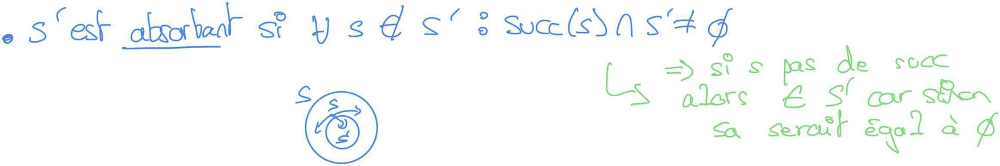

# S2

## Cycle 

À quel type de graphe s'apparente la notion de Cycle ?

%

Au graphe non orienté

## Circuit

À quel type de graphe s'apparente la notion de Circuit ?

%

À un graphe orienté

## Graphe acyclique

Qu'est-ce qu'un graphe acyclique ?

%

C'est un graphe qui n'admet pas de cycle ou de circuit.

## Propriété Graphe acyclique

Quelle propriété y a-t-il sur un graphe acyclique ?

%

Il possède un sommet sans successeur.

## Sous partie Sommet

Soit \\(G = (S, A)\\) un graphe orienté, \\(S' \subset S\\) quand dis t'on que 
\\(S'\\) est _stable_ ?

%

## Sous partie Sommet

Soit \\(G = (S, A)\\) un graphe orienté, \\(S' \subset S\\) quand dis t'on que 
\\(S'\\) est _absorbant_ ?

%

## Noyau d'un graphe

Qu'est ce qu'un noyau d'un graphe \\(G = (S, A)\\).

%

C'est un sous ensemble \\(S'\\) tel que \\(S' \subset S\\) et 
\\(S'\\) est stable et absorbant.

## Propriété Graphe

Soit un graphe oritné acyclique \\(G\\) que possède \\(G\\) ?

%

Un noyau unique

## Calcul du noyau d'un graphe

Comment calcule-t-on simplement le noyau d'un graphe orienté acyclique ?

%

1. Identifier tous les sommets sans prédécesseur.
2. Ajouter ces sommets au noyau.
3. Supprimer ces sommets et leurs arcs sortants (arc qui arrive dans le sommet) 
  du graphe.
4. Répéter les étapes 1 à 3 jusqu'à ce qu'il ne reste plus de sommets dans le graphe.

Le noyau obtenu est unique pour un graphe orienté acyclique.

