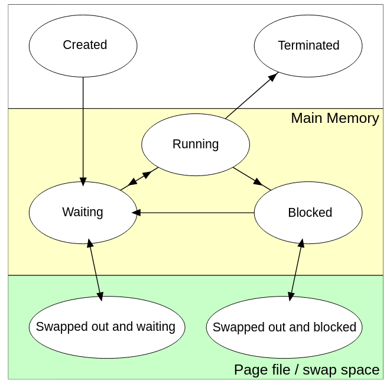

# S6

## Groupe 

Comment changer le groupe attribuer a un fichier ?

%

```chgrp```

## ACL

Que veut dire ACL ?

%

Il s'agit de Acesse Control List. C'est un concept qui permet d'ajouter une liste de groupes et une liste d'utilisatuer pour une gestion plus fine des droits sur un fichier.

## ACL 2

Comment lire la liste de contrôle sur un fichier ?

%

```getfacl```

## ACL 3

Comment lire modifier la liste de contrôle sur un fichier ?

%

```setfacl```

## ACL 4

Dans l'algorithme de calcule des droits que rajoute les ACL ?

%

Après le test si il s'agit du user qui détient le fichier, il y a un test sur la liste de user de l'acl.
De même pour le groupe.

## Quotas

Que sont les quotas ?

%

Il permet de limité des ressources du systèmes pour un user. ex: mémoire, disk ect...

## PAM

Expliquer ce qu'est PAM ?

%

Il s'agit d'une pile qui permet la mise en place de compte utilisateur en réseau.

## Job

Qu'est ce qu'un Job dans un shell ?

%

Il s'agit d'un groupe de processuse du point de vue du shell

## Swap

Expliqer en quoi est utiliser la mémoire swap ?

%

C'est un espace sur le disque qui permet au système si besoin de décharger des pages mémoires en les entrepossant dans ce swap. Cela permet d'alléger la ram utilisé. Si le processuse est rappeler alors le swap remontera dans la ram.

## Page mémoire

Expliquer ce que sont les pages mémoires.

%

Il s'agit de zone mémoire de qui découte les données utilisées par un processuse en plein de fragments.

## Fonctionnement Page mémoire

Comment fonctionne l'addressage à l'intérieurs d'un processuse.

%

Il utilise un adressage virtuelle, et c'est l'APU du processeur qui donne la correspondance entre adresse virtuelle et page mémoire.

## Accée mémoire

Pourquoi un processuce ne peut pas accéder a la mémoire d'un autre programme naturellement ?

%

Car un processuce utilise un système d'adressage virtuelle. Il ne peut supposement donc pas accéder a des zones dont il n'aurais pas le droit.

## Processuce

Donner le shéma de vie d'un processuce.

%



## Schema vie proc


%

- created : créé et prêt à être exécuté
- waiting : attend l'allocation d'un cur
- running : actif sur un cur
- blocked : en attente d’E/S ou d’un signal
- swap : de la mémoire a été placée sur disque pour libérer de la mémoire vive
- terminé (zombie): processus conservé en table, en général à cause du parent (lecture status)

## Fork 

Qu'est ce qu'est hérité du parent pour un thread ?

%

- table des descripteurs de fichiers (donc aussi entrée sortie), il partage donc les pointeurs lecture/ecriture
- le tas
- la pile est copier

## Fork 

Qu'est ce que le fork ne prend pas de sont parent ?

%

- le thread na pas le pid de son parent
- le child met reset les signaux attendu

## IPC

Que veut dire IPC ?

%

Interprocesse communication.

