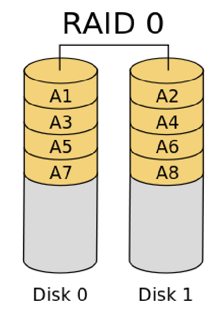

# S9

## RAID

Que veut dire __RAID__ ?

%

__R__edundant __A__rray of __I__ndependent __D__isks.

## Objectif RAID

Quelle sont les objetifs de la technologie __RAID__ ?

%

- l’augmentation des performances (RAID 0)
- la sécurité des données et la tolérance aux pannes (RAID 1).
- les deux (RAID 0+1, RAID 5)

## RAID 0

Comme RAID 0 fonctionne ?

%

Les données sont découpées en bandes (stripping) et réparties sur n disques.

