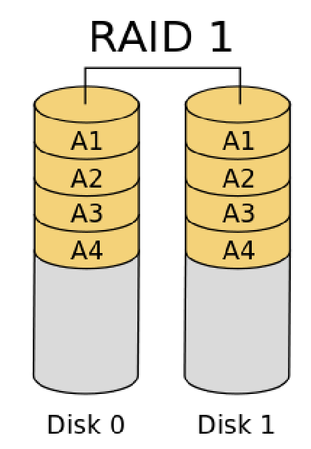
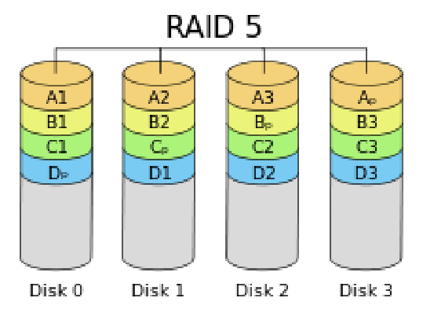

# S9

## RAID

Que veut dire __RAID__ ?

%

__R__edundant __A__rray of __I__ndependent __D__isks.

## Objectif RAID

Quelle sont les objetifs de la technologie __RAID__ ?

%

- l’augmentation des performances (RAID 0)
- la sécurité des données et la tolérance aux pannes (RAID 1).
- les deux (RAID 0+1, RAID 5)

## RAID 0

Comment le RAID 0 fonctionne ?

%

Les données sont découpées en bandes (stripping) et réparties sur n disques.


## RAID 1

Comment le RAID 1 fonctionne ?

%

Les données sont écrites de manières redondante sur n disques.



## RAID 5

Comment le RAID 5 fonctionne ?

%

Les données sont réparties (stripping) ainsi qu’une parité sur n disques 
combinant les avantages.



## RAID

Quelle commande permet la création et la maintenance d’une grappe RAID 
logicielle ?

%

L'outils __mdadm__.

## RAID 

Ou peut t'on trouver l'état du RAID ?

%

Dans `/proc/mdstat`.

## RAID 

Pour quelle raison est t'il mieux de faire un raid sur des partitions ?

%

Car dans un une table de partition il y a un champs avec ce qui est supposer 
être dans chacune des paritions.

## Parted

A quoi sert `paterd` ?

%

La même chose que `fdisk` sans passer par une version intéractive mais plutôt
par ligne de commande.

## fstab

A quoi correspond le dossier `/etc/fstab` ?

%

Il s'agit des point de montage a faire au bootage du système.

## resize2fs

A quoi sert la commande `resize2fs` ?

%

Elle permet d'augmenter la taille d'un système de fichier.

## Espace disponible

Quelle commande donne l'espace disponible sur un système de fichier ?

%

```df```.

## LVM

Que veut dire __LVM__ ?

%

__L__ogical __V__olume __M__anagement.