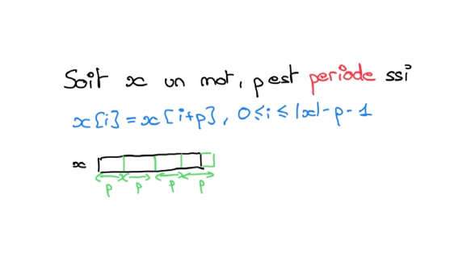
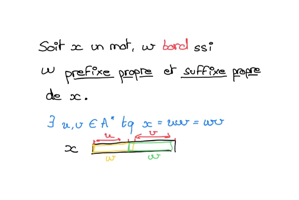

# s1

## Notation

Que note t'on \\( x^~ \\) ?

%

Il s'agit du miroire du mot x.

## sous-mot

Qu'est ce qu'un sous mot ?

%

Il s'agit d'une sous partie d'un mot tel que les lettres du mot d'origine 
puisse se lire de gauche a droite.

## Notation

Que nomme t'on \\(x \prec_{fact} y\\) ?

%

x est un facteur propre de y.

## Notation

Qu'est ce qu'un prefixe ?

%

Un découpage de la partie commencant à gauche du mot (pre-hisoire).

## Ordre lexicographique

Donner la definition formelle de l'ordre lexicographique.

%

\\(x \leq x \rightarrow\\)
\\(
\begin{equation}
\left\\{
\begin{aligned}
&x \preceq_{\text{pref}} y \quad \text{ou} \\\\
&x = uav \quad \text{et} \quad y = ubw \quad \text{avec} \quad u,v,w \in A^*, \\; a,b \in A, \\; \text{et} \\; a < b
\end{aligned}
\right.
\end{equation}
\\)

## Mot fibo

Donner la definition des mots de fibonnaci.

%

\\(f_0 = \varepsilon, \\; f_1=b, \\; f_2=a, \quad 
f_n = f_{n-1} \cdot f_{n-2}, \; \text{pour} \\; n \geq 3\\)

## Periode

Donner la definition d'une prériode d'un mot x.

%

## Bord

Donner la definition d'un bord de x.

%

