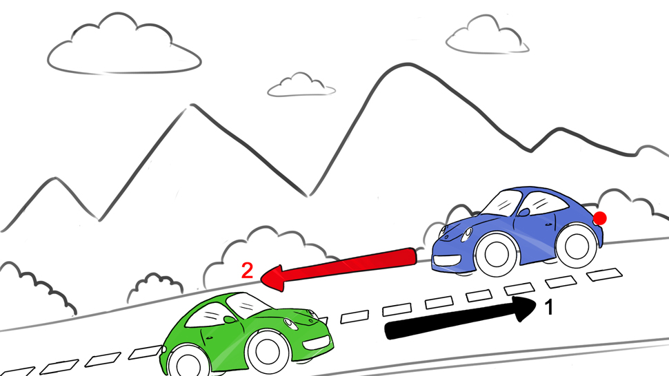
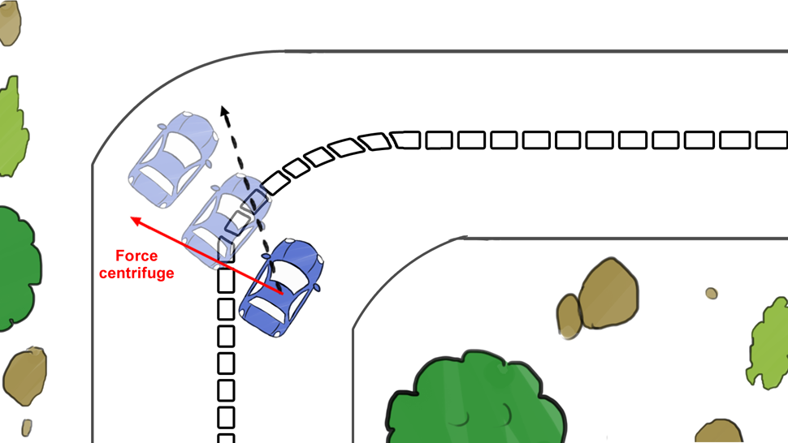
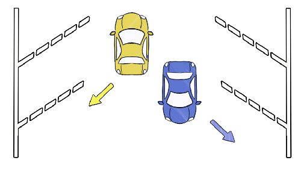
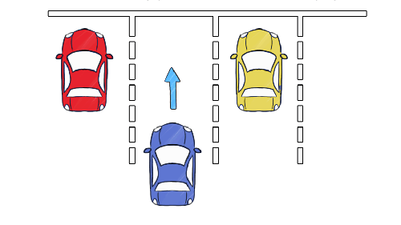
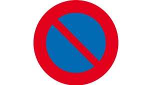
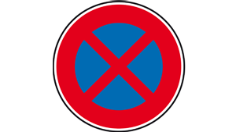

# Règles de circulation

## Descentes

Dans les descentes, s’il y a un croisement quel véhicule doit s'arrêter en 
cas de manque de place ?

%

Le véhicule descendant doit s'arrêter en premier. Faire attention, dans le cas 
d'un véhicule encombrant, c'est à la voiture de s'arrêter même si elle monte.

## Energie cinétique

Par combien doit multiplions-nous l'énergie cinétique quand on roule 2 fois 
plus vite ?

%

On multiplie cette énergie par 4, en effet la formule mathématique est la 
suivante :

$ec = 1/2\times M \times V^2$

## Force centrifuge

Par combien multiplions-nous la force centrifuge lorsque que l'on augment la 
vitesse ?

%

On multiplie cette énergie par 4, en effet la formule mathématique est la 
suivante :

$FC = mv^2/R$

## Mode de stationnement 

Quelle est-ce mode de stationnement ?

%

Il s'agit d'un stationnement en __epi__.

## Mode de stationnement 

Quelle est-ce mode de stationnement ?

%

Il s'agit d'un stationnement en __bataille__.

## Panneau

Que signifie ce panneau

%

Il signifie une interdiction de stationner.

## Panneau

Que signifie ce panneau

%

Il signifie une interdiction d'arrêt et de stationnement.