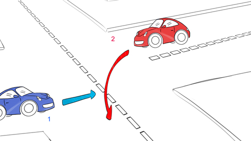
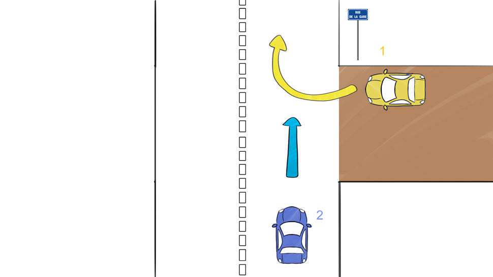

# Intersections

## Panneau sur feu

À quoi servent les panneaux de priorité sous les feux de signalisation ?

%

Les panneaux sous les feux règlent alors le régime de priorité uniquement si les 
feux clignotent ou ne fonctionnent pas.

## Panneau sur feu

Dans le cas d'un feu de signalisation sans panneau en dessous comment ce passe
les priorités ?

%

S'il n'y a pas de panneaux, alors c'est la règle de la __priorité à droite__ 
qu'il faut appliquer.

## Priorité intersection

Dans une intersection sans signalisation comment se gère les priorités ?

%

En l'absence de panneau, la règle à appliquer est celle de la 
__priorité à droite__.

## Question priorité

Dans le cas de cette image, qui a la priorité ? 

%

Le véhicule d'en face veut tourner à sa gauche donc je suis à sa droite quand il 
tourne. C'est moi qui suis prioritaire en allant tout droit (voiture bleue).

## Question priorité

Dans cette image qui a la priorité ?

%

- cas n°1 : quand le chemin fait partie du domaine public, les règles de 
priorité normales s'appliquent.

- cas n°2 : quand le chemin de terre est privé la règle de la priorité à droite ne s'applique plus.