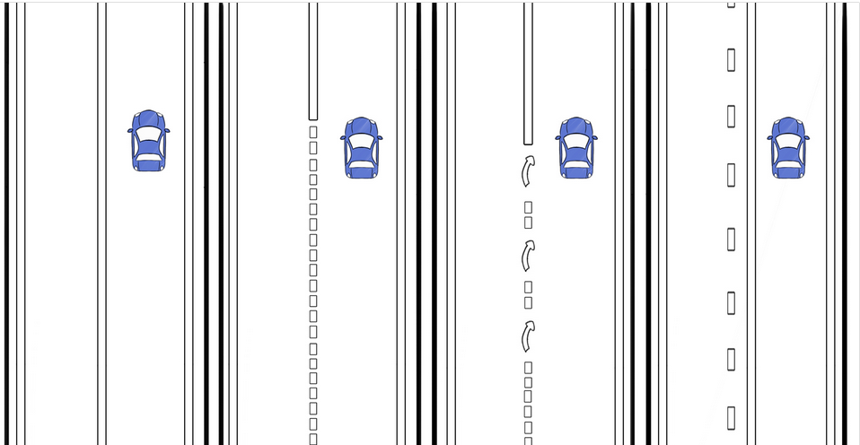
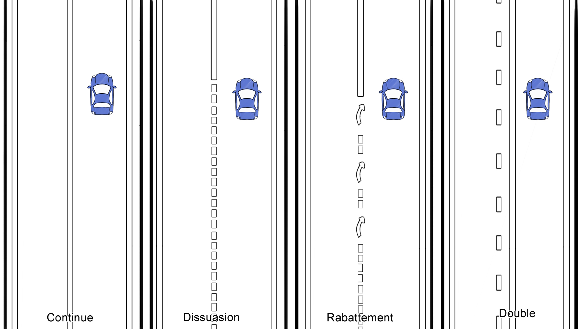
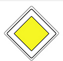
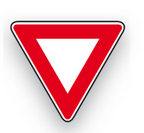
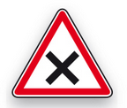
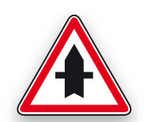

# Signalisation verticale

## Lignes

Donnez le nom de chacune des lignes :

%

## Ligne continue

Expliquer le principe de la ligne continue.

%

Il est strictement interdit de la __franchir__. Il est désormais possible de 
__chevaucher__ une ligne continue pour dépasser un cycliste, lorsque la 
visibilité du conducteur est __suffisante__.

## Ligne de dissuasion

Expliquer le principe de la ligne de dissuasion.

%

Elle a deux rôles :
- sur __routes sinueuses__, en pentes, ou empruntées par des véhicules lents,
signifie qu'il est dangereux d'opérer un dépassement des véhicules qui roulent 
normalement : 70 km/h ou plus selon les types de route.

- Sur __autoroute__, la ligne de dissuasion sert à __interdire le rabattement__ 
des usagers situés sur la voie tout à gauche qui voudraient emprunter une 
sortie qu'ils n'auraient pas anticipée.

💡 revanche, elle n'interdit pas le dépassement.

## Les flèches de rabattement

Expliquer le principe des flèches de rabattement.

%

Sur des routes à double sens de circulation, lorsque les flèches sont dans 
votre sens, cela signifie que la ligne discontinue va bientôt devenir continue. 

💡 flèches apparaissent alors et vous devez avoir fini votre dépassement 
__AVANT__ la 3ème.

💡 il n'est pas question de commencer un dépassement quand vous voyez des flèches de rabattement !

## Stationnement

Quand est-il possible de stationner à coter de la route ?

%

Lorsque les lignes de rive sont discontinues, il est possible de s'arrêter sur 
l'accotement ou d'y stationner si l'espace est suffisant et que vous n'empiétez 
pas sur la route.

## Ligne discontinue

À quoi servent les lignes discontinues et quelle sont leur espacement ?

%

Elle sépare les deux voies de circulation et vous permet d'effectuer un 
dépassement ou de changer de direction.

L'espacement des lignes discontinues sont des multiples de 13 mètres, 
c'est-à-dire qu'1 ligne discontinue + l'intervalle est égal à 13 mètres.

## Panneau d'obligation temporaire

Comment savoir si un panneau d'obligation est temporaire ?

%

Les panneaux d'obligation temporaire ne sont pas jaune, ils sont poser au sol dans ce cas.

## Panneau

Que signifie ce panneau ?

%

Il signifie que vous bénéficierez de la priorité de passage aux prochaines 
intersections.

## Limitation paris

Je roule dans une agglomération Parisienne, je suis soumis à quelle limitation 
de vitesse ?                    

%

Toutes agglomérations Parisienne sont limité à __30 km/h__.

## Route deux vois hors agglomération

Sur une route séparée par une ligne médiane, lorsqu’il y a deux voies de 
circulation dans le même sens, Quelle est la limitation ?

%

Dans ce cas la limitation est de __90  km/h__.

## Période probatoire

Comment sont limité les vitesses dans le cas d'un permis probatoire ?

%

Dans le cas d'un permis probatoire, toutes les vitesses sont limitées comme ci 
il pleuvait.

## Panneau

Que signifie ce panneau ?

%

Il s'agit d'un panneau de céder le passage.

## Panneau 

Que signifie ce panneau ?

%

Il s'agit d'un panneau indiquant qu'il faut céder le passage au véhicule 
arrivant à droite.

## Panneau

Que signifie ce panneau ?

%

Il s'agit d'un panneau indiquant que vous avez la priorité sur les 
intersections.         
