# Panneau

## Forme triangulaire

Que représente un panneau de forme triangulaire ?

%

Un danger.

## Forme ronde

Que représente un panneau de forme ronde ?

%

Un ordre :
- une obligation
- une interdiction

## Forme carre

Que représente un panneau de forme carre ?

%

Une indication

## Forme rectangulaire

Que représente un panneau de forme rectangulaire ?

%

Une localisation

## Couleur 1

Que signifie un panneau de cette forme ?

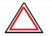

%

Un panneau permanent

## Couleur 2

Que signifie un panneau de cette forme ?

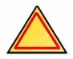

%

Un panneau temporaire

## Couleur 3

Que signifie un panneau de cette forme ?

%

Un panneau d'interdiction

## Couleur 4

Que signifie un panneau de cette forme ?

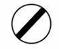

%

Un panneau de fin d'interdiction

## Couleur 5

Que signifie un panneau de cette forme ?

%

Un panneau d'obligation

## Couleur 6

Que signifie un panneau de cette forme ?

%

Un panneau de fin d'obligation

## Couleur 7

Que signifie un panneau de cette forme ?

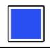

%

Un panneau d'indication pour la conduite

## Couleur 8

Que signifie un panneau de cette forme ?

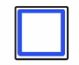

%

Un panneau d'installation et d'aménagement

## Couleur 9

Que signifie un panneau de cette forme ?

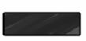

%

Un panneau donnant le nom d'un lieu

## Couleur 10

Que signifie un panneau de cette forme ?

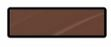

%

Un panneau indiquant un itinéraire touristique

## Couleur 11

Que signifie un panneau de cette forme ?

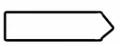

%

Une indication local

## Couleur 12

Que signifie un panneau de cette forme ?

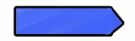

%

Une autoroute

## Couleur 13

Que signifie un panneau de cette forme ?

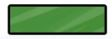

%

Une ville importante

## Couleur 14

Que signifie un panneau de cette forme ?

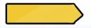

%

Une indication temporaire

## Distance d'application danger

Quelle sont les distances d'applications d'un panneau danger ?

%

- __150 mètres avant le danger hors agglomération ;__
- __50 mètres avant le danger en agglomération.__

<u>__Execption__:</u> pour les panonceaux en dessous de panneau de danger.
Ci-dessous, le panneau vous avertit d'un virage à droite dans 500 m.

Le panonceau peut aussi préciser une __étendue__, c'est-à-dire __une distance tout au long de laquelle le danger sera présent__. Dans ce cas, 2 flèches noires encadrent la distance indiquée sur le panonceau.

Le danger sera situé à la __distance normale__ du panneau (à 150 m hors agglomération et 50 m en ville) !

## Niveau de mise en place 

A quel niveau ce panneau prend-il effet ?

%

Ce panneau prend effet __au niveau de la mise en place des deux sens de 
circulation__ que ce soit en ville ou hors agglomération , c'est une 
__exception__.

## Interdiction effet

A quelle distance prend effet un panneau d'interdiction ?

%

__L'interdiction prend effet à hauteur du panneau__.

## Interdiction durée

Quand s'arrêté l'interdiction d'un panneau d'interdiction ?

%

L'interdiction s'arrête à la prochaine __intersection__ ou quand un panneau 
de fin __d'interdiction__ y met fin.

