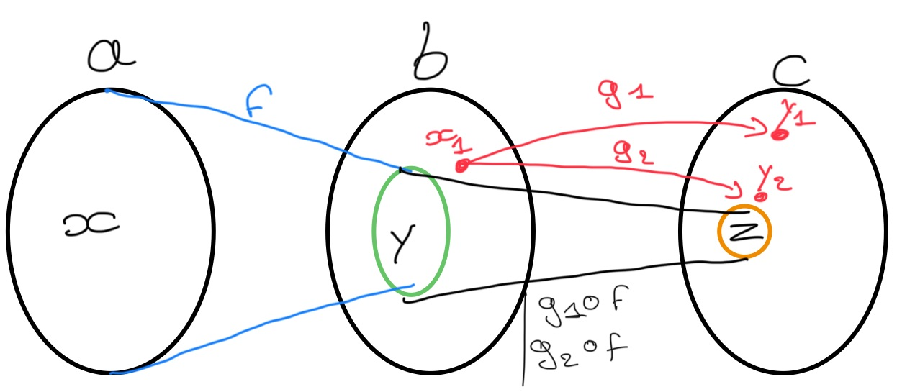

# Catégorie

## Fonction injective

Quand dis t'on qu'une fonction $f : E \to F$ est __injective__ ?

%

$f$ est __injective__ ssi $\forall x, x' \in E^2, f(x) = f(x') \Rightarrow x = x'$

[#math](./math.md)

## Fonction surjective

Quand dis t'on qu'une fonction $f : E \to F$ est __surjective__ ?

%

$f$ est __surjective__ ssi $\forall y \in F, \exists  x \in E$ tel que 
$f(x) = y$

[#math](./math.md)

## Fonction bijective

Quand dis t'on qu'une fonction $f : E \to F$ est __bijective__ ?

%

$f$ est une __bijection__ de $F$ vers $E$ si tous les éléments de l'ensemble 
d'arriver $F$ a exactement un __antécédent__ dans $E$ par $f$, ce qui 
s'écrit formellement :
$$\forall x \in E, \exists! x \in E,  f(x) = y$$

[#math](./math.md)

## Ensemble dénombrable

Quand dis t'on qu'un ensemble $E$ est __dénombrable__ ?

%

$E$ est __dénombrable__ ssi $\exists f, f : E \to \mathbb{N}$ avec $f$ une 
__bijection__.

[#math](./math.md)

## Catégorie

Donnez la définition d'une __catégorie__ ?

%

Une __catégorie__ est un certain nombre d'__objet__ et de __flèche__ (appelé 
__morphisme__). Les flèches doivent pouvoir être composé, la composition doit 
être __associative__. Tous les objets doivent avoir une __flèche d'identité__, 
servent de l'indentité dans la composition.

[#categorie](./categorie.md)

## __Hask__

Qu'est ce qu'un __Hask__ ?

%

Un __Hask__ est la cathegory des types en _Haskell_, où les objets sont des 
_ensembles_ contenant tousse l'élément $\bot$. Tous morphisme peut alors 
renvoyer $\bot$ généralement utilisé pour représenter un calcule infini.

[#categorie](./categorie.md) [#programmation](./programmation.md)

## Fonction pure

Donnez la définition d'une __fonction pure__ ?

%

Une fonction est __pure__ ssi :
 - Pour la même entrée, elle retourne toujours le même résultat;
 - La fonction n'utilise et ne produit pas __d'effet de bords__;

[#programmation](./programmation.md)

## Fonction Void

Comment appelle-t-on une fonction de signature $\emptyset \to a$ avec $a$ un 
ensemble quelconque et $\emptyset$ l'ensemble ne contenant aucun élément.

%

Une fonction $f : \emptyset \to a$ porte le nom de __absurde__ 
(_ex falso sequitur quodlibet_).

[#categorie](./categorie.md)

## Fonction vers le type Bool

Comment peut'on appeler une fonction à pour ensemble d'arrivé $\mathbb{B}$.

%

On peut nommés __predicat__ toutes fonction aillant pour ensemble d'arrivé 
$\mathbb{B}$.

[#programmation](./programmation.md) [#math](./math.md)

## Free category

Qu'est-ce qu'une __free category__ ?

%

Une __free category__ est une catégory tel que :
- les objets sont les sommets d'un graphs orienté;
- les morphisms sont les couples de sommet représentant un arc de ce graph;

[#categorie](./categorie.md)

## Préordre

Qu'est ce qu'un __préordre__ ?

%

Un __préordre__ est une relation binaire __réfléxive__ et __transitive__ :
- $\forall x \in E, x \mathcal{R}x$, __réflexivité__;
- $\forall x,y,z \in E, x \mathcal{R} y \land y \mathcal{R} z \Rightarrow x  \mathcal{R} z$, __transitivité__;

[#math](./math.md)

## Ordre partiel

Qu'est ce qu'un __ordre paritel__ ?

%

Un __ordre paritel__ est une relation binaire __réfléxive__, 
__anti-symétrie__ et __transitive__ :
- $\forall x \in E, x \mathcal{R}x$, __réflexivité__;
- $\forall x, y \in E, x \mathcal{R}y \land y \mathcal{R} x \Rightarrow x = y$, 
__anti-symétrie__;
- $\forall x,y,z \in E, x \mathcal{R} y \land y \mathcal{R} z \Rightarrow x  \mathcal{R} z$, __transitivité__;

[#math](./math.md)

## Ordre total

Qu'est ce qu'un __ordre total__ ?

%

Un __ordre total__ est un relation binaire tel que :
$$\forall x, y\in E, x \mathcal{R} y \lor y \mathcal{R} x$$

[#math](./math.md)

## Thin category

Qu'est-ce qu'une __thin category__ ?

%

Une __thin category__ est une catégorie telle qu'il existe au plus un 
__morphisme__ depuis n'importe quel objet $a$ vers n'importe quel objet $b$.

[#categorie](./categorie.md)

## Hom-set

Qu'est ce qu'un __hom-set__ ?

%

Un __hom-set__ est un ensemble de __morphitms__ d'un objet $a$ à un objet $b$ 
dans une catégorie $C$, on le note $C(a,b)$ ou même $Hom_C(a,b)$.

[#categorie](./categorie.md)

## Préordre hom-set

Qu'elle propriété y a t'il sur un __hom-set__ dans un __préordre__ ?

%

Un __hom-set__ dans un __préordre__ est soit vide, soit ne contient qu'un seul 
élément.

[#categorie](./categorie.md)

## Monoid

Qu'est ce qu'un __monoid__ ?

%

Un __monoid__ est définie comme un ensemble muni d'un opérateur binaire. 
Cette opérateur doit être __associatif__ et l'ensemble doit contenir un 
__élément neutre__.

[#categorie](./categorie.md)

## Monoid catégorie

Qu'est ce qu'une __catégorie monoid__ ?

%

Un __monoid__ est une catégorie d'un seul objet, avec des __morphismes__ qui 
suivent les règles appropriées.

[#categorie](./categorie.md)

## Extraction monoid

Expliquer comment à partir d'une catégorie d'un seul élément on peut obtenir 
un __monoid__ ?

%

On prend l'__homo-set__ $M(m, m)$, de seul objet $m$ de la catégorie $M$. 
L'opérateur binaire est celui de la composition des éléments de l'__homo-set__.
- Cette composition de fonction _existe toujours_ par la propriété d'existance
de la composition de morphisme.
- Cette composition est _associative_ par propriété de morphisme.
- Le morphisme d'_identité_ est l'élément neutre.

On peut donc à partir d'une catégorie d'un seul élément, créer un __monoid__.

[#categorie](./categorie.md)

## Catégorie localement petite

Quand dis t'on qu'une catégorie est __localement petite__ ?

%

On dit qu'une catégorie est __localement petite__ lorsque les morphismes entre 
deux objets quelconque forme un ensemble.

[#categorie](./categorie.md)

## Denotational sementics

Qu'est-ce que l’on entend par __Denotational sementics__ ?

%

Le __Denotational sementics__ désigne l'approche de formalisation de 
langage de programmation par la création d'objet mathématique.

[#programmation](./programmation.md)

## Higher-order function

Que nomme t'on __Higher-order function__ ?

%

Une __Higher-order function__ est une fonction qui prend au moins une autre 
fonction en paramettre.

[#programmation](./programmation.md) 

## Parametrically polymorphic

Quand dis t'on qu'une fonction est __Parametrically polymorphic__ ?

%

Une fonction est __Parametrically polymorphic__ si elle peut être implémentée 
à l'aide de la même formule pour n'importe qu'elle type.

[#programmation](./programmation.md)

## Composition

Qu'appelle-t-on __composition__ dans la théorie des catégories ?

%

Pour chaque pair de morphisme $f, g$ ou l'ensemble d'arrivée de $f$ est celui de 
départ de $g$, alors il doit exister la composition de ces morphismes notée 
$g \circ f$. Si les morphismes sont des fonctions cela reviendrai à écrire 
$g(f(x))$.

[#categorie](./categorie.md)

## Bijection réciproque

Expliquer c'est qu'est une __bijection réciproque__ ?

%

Une __bijection réciproque__ noté $g$, est la fonction _réciproque_ de la 
bijection $f$, tel que $g \circ f = id$

[#math](./math.md)

## Propriété bijection réciproque

Expliquer pourquoi la réciproque d'une bijection est aussi une bijection ?

%

La réciproque d'une bijection est aussi une bijection car :
- Les deux ensembles ont le même nombre d'éléments (injection implique que la 
fonction de base est total et surjection)
- Il ne peut y avoir qu'une seule correspondance image antécédente à l'aide de 
la surjection

[#math](./math.md)

## Fonction totale

Donnez la définition d'une __fonction totale__.

%

Une __fonction totale__ est une fonction qui admet une image pour chaque élément 
de son domaine de définition.

[#math](./math.md)

## Fonction partielle

Donnez la définition d'une __fonction partielle__.

%

Une __fonction partielle__ est une fonction qui exclus des éléments de 
l'ensemble de départ.

[#math](./math.md)

## Mémoïsation

À quelle action s'apparente le terme __mémoïsation__ ?

%

La __mémoïsation__ d'une fonction correspond à la mise en cache des valeurs de
retour d'une fonction selon ses valeurs d'entrée. Cette mise en cache se fait 
généralement par une fonction __mémoise__.

[#programmation](./programmation.md)

## Catégorie set

Donnez la définition de la __catégorie set__.

%

La __catégorie set__ est une catégorie dont :
- les objets sont des ensembles ;
- les morphismes sont des fonctions ;

[#categorie](./categorie.md)

## Relation, fonction

Donnez de façon informelle les différences entre une relation et une fonction.

%

1. Une relation n'a pas de 'sens' alors qu'une fonction à bien un 'sens', 
$f :: a \to b$ ;
2. Dans une relation on peut avoir un élément qui est en relation avec plein
d'autre $x \mathcal{R} x_1 \land x \mathcal{R} x_2$ or par une fonction, un 
antécédent ne peut avoir qu'une seule image $f(x) = y$.
3. Quand on parle de fonction, on induit fonction totale or dans une relation,
il est souvent possible qu'un élément ne soit en relation avec aucun autre 
élément.

[#math](./math.md)

## Domaine

Qu'appelle-t-on __domaine__ d'une fonction ?

%

Le __domaine__ d'une fonction est l'ensemble de départ de celle-ci.

[#math](./math.md)

## Co-domaine

Qu'appelle-t-on __co-domaine__ d'une fonction ?

%

Le __co-domaine__ d'une fonction est l'ensemble d'arrivé de celle-ci.

[#math](./math.md)

## Isomorphisme (math)

En mathématiques qu'est-ce qu'un __isomorphisme__ ?

%

Une fonction $f$ est dites __isomorphisme__ ssi cette fonction admet une 
fonction réciproque que l'on note $f^{-1}$ avec $f(x) = y \land f^{-1}(y) = x$.

[#math](./math.md)

## Isomorphisme (théorie des catégories)

Dans la théorie des catégories qu'est-ce qu'un __isomorphisme__ ?

%

Un __isomorphisme__ est un morphisme $f :: a \to b$, tel qu'il existe un autre 
morphisme $g :: b \to a$ tel que :
$$g \circ f = id_a \land f \circ g = id_b$$

[#categorie](./categorie.md)

## Epimorphisme

Qu'est ce qu'une __epimorphisme__ ?

%

Un morphisme $f :: a \to b$ est un __epimorphisme__ ssi :
$$\forall c \text{ (un objet) }, \forall (g_1, g_2) :: b \to c
\text{ (deux morphismes) }, $$
$$ g_1 \circ f = g_2 \circ f \Rightarrow g_1 = g_2$$

<u>Explication :</u>
On se place pour cette explication dans une __category set__.



L'idée est que si f n'est pas surjectif, on voit bien que changer les images 
de $g_1,  g_2$ dans la partie rouge ne va rien changer à l'égalité 
($g_1 \circ f = g_2 \circ f$) si $g_1 = g_2$ pour tous les antécédents dans le
sous-ensemble en vert.

[#categorie](./categorie.md)

## Monomorphisme

Qu'est-ce qu'un __monomorphisme__ ?

%

Un morphisme $f :: a \to b$ est un __monomorphisme__ ssi :

$$\forall c \text{ (objet) }, \forall g_1, g_2 :: c \to a,$$
$$f \circ g_1 = f \circ g_2 \Rightarrow g_1 = g_2$$

<u>Explication :</u>
On se place pour cette explication dans une __category set__ et ici $f$ ne 
correspond pas à un __monomorphisme__.


L'idée est que $z$ diffère seulement pour $x_1$ et $x_2$, mais pourtant on 
obtient bien que $f \circ g_1 = f \circ g_2$ et cela implique que f n'est pas 
injective donc pas un __monomorphisme__.

[#categorie](./categorie.md)

## Type spécial (Hakell)

Donner le nom des types et des possibles éléments _Haskell_ correspondant 
respectivement à l'ensemble vide et l'ensemble contenant qu'un seul élément.

%

- Le type correspondant à l'ensemble vide du _haskell_ : __Void__
```haskell
absurd :: Void -> a
```
- le type d'un seule élément est : ```()``` appelé __Unit__, sont seul élément 
est ```()```
```haskell
() :: ()
unit :: a -> ()
```

[#programmation](./programmation.md)