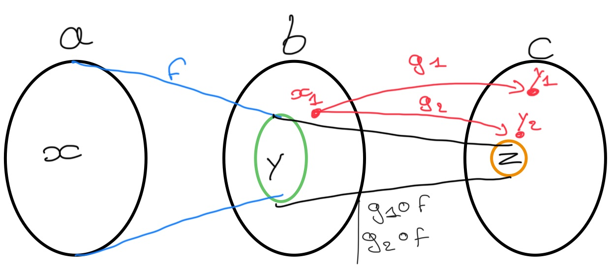
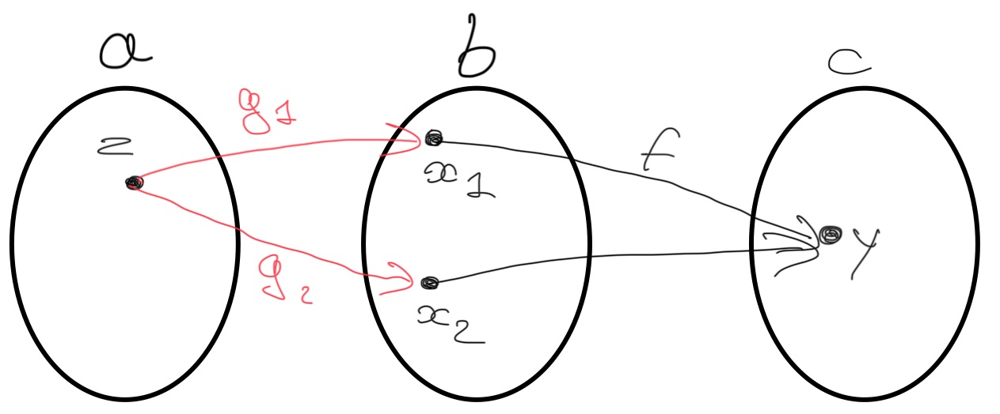

# Catégorie

## Composition

Qu'appelle-t-on __composition__ dans la théorie des catégories ?

%

Pour chaque pair de morphisme $f, g$ ou l'ensemble d'arrivée de $f$ est celui de 
départ de $g$, alors il doit exister la composition de ces morphismes notée 
$g \circ f$. Si les morphismes sont des fonctions cela reviendrai à écrire 
$g(f(x))$.

[#categorie](./categorie.md)

## Bijection réciproque

Expliquer c'est qu'est une __bijection réciproque__ ?

%

Une __bijection réciproque__ noté $g$, est la fonction _réciproque_ de la 
bijection $f$, tel que $g \circ f = id$

[#math](./math.md)

## Propriété bijection réciproque

Expliquer pourquoi la réciproque d'une bijection est aussi une bijection ?

%

La réciproque d'une bijection est aussi une bijection car :
- Les deux ensembles ont le même nombre d'éléments (injection implique que la 
fonction de base est total et surjection)
- Il ne peut y avoir qu'une seule correspondance image antécédente à l'aide de 
la surjection

[#math](./math.md)

## Fonction totale

Donnez la définition d'une __fonction totale__.

%

Une __fonction totale__ est une fonction qui admet une image pour chaque élément 
de son domaine de définition.

[#math](./math.md)

## Fonction partielle

Donnez la définition d'une __fonction partielle__.

%

Une __fonction partielle__ est une fonction qui exclus des éléments de 
l'ensemble de départ.

[#math](./math.md)

## Mémoïsation

À quelle action s'apparente le terme __mémoïsation__ ?

%

La __mémoïsation__ d'une fonction correspond à la mise en cache des valeurs de
retour d'une fonction selon ses valeurs d'entrée. Cette mise en cache se fait 
généralement par une fonction __mémoise__.

[#programmation](./programmation.md)

## Catégorie set

Donnez la définition de la __catégorie set__.

%

La __catégorie set__ est une catégorie dont :
- les objets sont des ensembles ;
- les morphismes sont des fonctions ;

[#categorie](./categorie.md)

## Relation, fonction

Donnez de façon informelle les différences entre une relation et une fonction.

%

1. Une relation n'a pas de 'sens' alors qu'une fonction à bien un 'sens', 
$f :: a \to b$ ;
2. Dans une relation on peut avoir un élément qui est en relation avec plein
d'autre $x \mathcal{R} x_1 \land x \mathcal{R} x_2$ or par une fonction, un 
antécédent ne peut avoir qu'une seule image $f(x) = y$.
3. Quand on parle de fonction, on induit fonction totale or dans une relation,
il est souvent possible qu'un élément ne soit en relation avec aucun autre 
élément.

[#math](./math.md)

## Domaine

Qu'appelle-t-on __domaine__ d'une fonction ?

%

Le __domaine__ d'une fonction est l'ensemble de départ de celle-ci.

[#math](./math.md)

## Co-domaine

Qu'appelle-t-on __co-domaine__ d'une fonction ?

%

Le __co-domaine__ d'une fonction est l'ensemble d'arrivé de celle-ci.

[#math](./math.md)

## Isomorphisme (math)

En mathématiques qu'est-ce qu'un __isomorphisme__ ?

%

Une fonction $f$ est dites __isomorphisme__ ssi cette fonction admet une 
fonction réciproque que l'on note $f^{-1}$ avec $f(x) = y \land f^{-1}(y) = x$.

[#math](./math.md)

## Isomorphisme (théorie des catégories)

Dans la théorie des catégories qu'est-ce qu'un __isomorphisme__ ?

%

Un __isomorphisme__ est un morphisme $f :: a \to b$, tel qu'il existe un autre 
morphisme $g :: b \to a$ tel que :
$$g \circ f = id_a \land f \circ g = id_b$$

[#categorie](./categorie.md)

## Epimorphisme

Qu'est ce qu'une __epimorphisme__ ?

%

Un morphisme $f :: a \to b$ est un __epimorphisme__ ssi :
$$\forall c \text{ (un objet) }, \forall (g_1, g_2) :: b \to c
\text{ (deux morphismes) }, $$
$$ g_1 \circ f = g_2 \circ f \Rightarrow g_1 = g_2$$

<u>Explication :</u>
On se place pour cette explication dans une __category set__.



L'idée est que si f n'est pas surjectif, on voit bien que changer les images 
de $g_1,  g_2$ dans la partie rouge ne va rien changer à l'égalité 
($g_1 \circ f = g_2 \circ f$) si $g_1 = g_2$ pour tous les antécédents dans le
sous-ensemble en vert.

[#categorie](./categorie.md)

## Monomorphisme

Qu'est-ce qu'un __monomorphisme__ ?

%

Un morphisme $f :: a \to b$ est un __monomorphisme__ ssi :

$$\forall c \text{ (objet) }, \forall g_1, g_2 :: c \to a,$$
$$f \circ g_1 = f \circ g_2 \Rightarrow g_1 = g_2$$

<u>Explication :</u>
On se place pour cette explication dans une __category set__ et ici $f$ ne 
correspond pas à un __monomorphisme__.



L'idée est que $z$ diffère seulement pour $x_1$ et $x_2$, mais pourtant on 
obtient bien que $f \circ g_1 = f \circ g_2$ et cela implique que f n'est pas 
injective donc pas un __monomorphisme__.

[#categorie](./categorie.md)

## Type spécial (Hakell)

Donner le nom des types et des possibles éléments _Haskell_ correspondant 
respectivement à l'ensemble vide et l'ensemble contenant qu'un seul élément.

%

- Le type correspondant à l'ensemble vide du _haskell_ : __Void__
```haskell
absurd :: Void -> a
```
- le type d'un seule élément est : ```()``` appelé __Unit__, sont seul élément 
est ```()```
```haskell
() :: ()
unit :: a -> ()
```

[#programmation](./programmation.md)