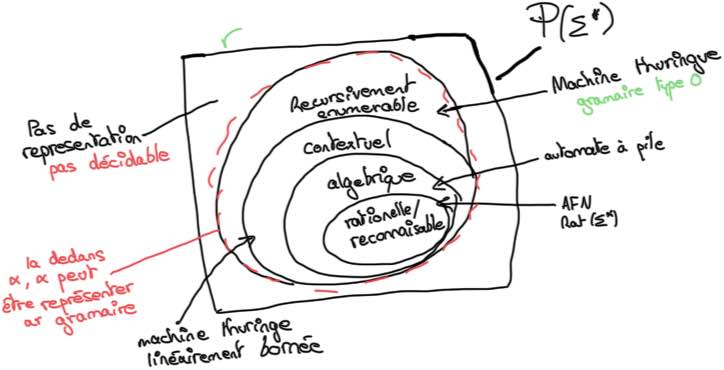

# General 3

## Hierarchy Chomski

Donner la hierarchi de chomski.

%

## Hierarchy Chomski 2

Donner pour chaque classification de la hierarchie de chomski une construciton pour le reconnaitre.

%

## Parcour largeur

Décrire ce qu'est un parcour en largeur.

%

## Parcour Profondeur

Décrire ce qu'est un parcour en profondeur

%

## Log1

Pour chaque point donner une égaliter :
- \\(log_b(xy)\\)         
- \\(log_b(x/y)\\)
- \\(log_b(x^y)\\)
- \\(log_b(1)\\)
- \\(log_b(b)\\)
- \\(log_b(b^n)\\)
- \\(log_b(1/n)\\)
- \\(-log_b(n)\\)

%

- \\(log_b(xy) = log_b x + log_b y\\)
- \\(log_b(x/y) = log_b x - log_b y\\)
- \\(log_b(x^y) = y * log_b x\\)
- \\(log_b(1) = 0\\)
- \\(log_b(b) = 1\\)
- \\(log_b(b^n) = n\\)
- \\(log_b(1/n) = -log_b n\\)
- \\(-log_b n = log_b(1/n)\\)