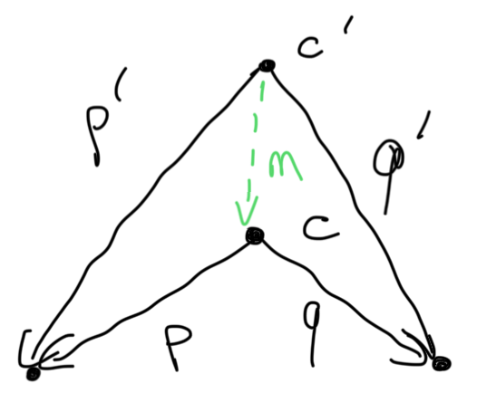
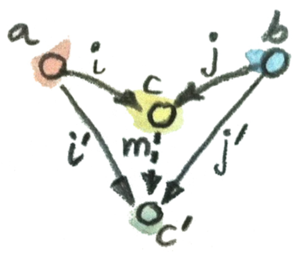

# Catégorie

## Kleisli category

Expliquer à quoi correspond la  __kleisli category__.

%

Une __kleisli category__ contient des objets qui corresponde au type d'un dit
langage de programmation. Les morphismes d'un type _A_ vers un type _B_ sont des 
fonctions aillant le domaine _A_ vers l'`embellishment` du type _B_ 
(`embellishment` correspond à une construction [dans la composition] qui 
permet de sauvegarder d'autre information que le résultat qui est de type 
_B_).

[#categorie](./categorie.md)

## Writer monad

Expliquer à quoi correspond la __writer monad__.

%

La __writer monad__ est une monade qui permet de sauvegarder une chaine de 
caractère en plus du résultat d'une fonction. Une telle construction peut 
permettre la mise en place de 'log' dans un programme _Haskell_.

[#categorie](./categorie.md)

## Initial object

Quand dis t'on qu'un objet d'une catégorie est un __objet inital__ ?

%

Un objet est un __objet inital__ ssi :
- il a un et seulement un morphisme allant à tous les objets de la catégorie.

<u>Formellement :</u>
Un objet $c$ est __initial__ ssi :
$$\forall a \text{ (un objet) }, \exist f :: c \to a$$
$$\land$$
$$\forall g, f :: c \to a, f = g$$

[#categorie](./categorie.md)

## Terminal object

Quand dis t'on qu'un objet d'une catégorie est un __objet terminal__ ?

%

Un objet est __terminal__ est l'objet avec un et seulement un morphisme 
provenant de tous les objets de la catégorie.

<u>Formellement :</u>
Un objet $c$ est __terminal__ ssi :
$$\forall a \text{ (un objet) }, \exist f :: a \to c$$
$$\land$$
$$\forall g, f :: a \to c, f = g$$

[#categorie](./categorie.md)

## Propriété initial et final

Quelle propriété y a-t-il pour catégorie qui admet un objet __terminal__ et 
un __final__ ?

%

Si une catégorie admet un __terminal__ et un __final__ alors il existe 
toujour un unique morphisme $f$ tel que $f :: Void \to ()$ (avec $Void$ 
l'ensmble vide et $()$ l'ensemble composer d'un seul élément).

[#categorie](./categorie.md)

## Uniqueness up to isomorphisme

Qu’entend-on par __uniqueness up to isomorphisme__ ?

%

__Uniqueness up to isomorphisme__ permet de parler d'une sorte d'égalité entre 
deux objets d'une catégorie à un __isomorphisme__ prêt. Donc __uniqueness up to 
isomorphisme__ signifie par exemple qu'il ne peut y avoir qu'un seul objet 
__initial__ ou __final__ à plusieurs __isomorphisme__ prêt.

[#categorie](./categorie.md)

## Product

Comment est définie le __categorical product__ de deux objet $a$ et $b$ ?

%

<u>Informellement :</u>
Un __produit__ de deux objets $a$ et $b$ est un objet $c$ équipé de deux 
projections__ tel que pour n'importe quelle autre objet $c'$ lui-même équiper
de deux projections, il existe un unique morphisme $m :: c' \to c$ qui factorise
les deux projections de $c'$. On appellera $m$ le __factorizer__. 

<u>Formellement :</u>
Soit $a, b$ deux objets, on appellera alors l'objet $c$ muni de deux projections
$p :: c \to a$ et $q :: c \to b$ le __categorical product__ ssi :
$$\forall c' \text{ (objet) }, p' :: c' \to a, q' :: c' \to b,$$
$$\exist! m :: c' \to c\text{ (factorizer) tel que :}$$
$$p' = p \circ m \land q' = q \circ m$$



[#categorie](./categorie.md)

## Opposite category

Qu'appelle-t-on l'__Opposite category__ ?

%

L'__opposite category__ d'une catégorie $C$ est noté $C^{op}$, elle est obtenue
en renversant tous le sens des flèches de la catégorie $C$. Même les morphismes
snt inverser, pour un morphisme $f :: a \to b$ de $C$, il y aura $f^{op} :: b 
\to a$ dans $C^{op}$.

De manière générale chaque construction dans une catégorie admettra une sorte 
de construction opposée dans l'__opposite category__. Une telle construction 
sera préfixe par `co`.

[#categorie](./categorie.md)

## Initial object (terminal)

Diviniser l'__objet inital__ à l'aide du __terminal__.

%

On peut définir __objet inital__ comme étant l'objet __terminal__ dans 
l'__opposite category__.

[#categorie](./categorie.md)

## Co-product

Comment est définie le __co-product__ de deux objet $a$ et $b$ ?

%

<u>Informellement :</u>
Un __co-product__ de deux objets $a$ et $b$ est l'objet $c$ équipé de deux 
__injections__ tel que pour n'importe quel objet $c'$ équipé de deux injections
il existe un unique morphisme $m :: c \to c'$ qui __factorise__ les injections.

<u>Formellement :</u>
Soit $a, b$ deux objets, on appellera alors l'objet $c$ muni de deux projections
$i :: a \to c$ et $j :: b \to c$ le __categorical co-product__ ssi :
$$\forall c' \text{ (objet) }, i' :: a \to c, j' :: b' \to c,$$
$$\exist! m :: c \to c'\text{ (factorizer) tel que :}$$
$$i' = m \circ i \land j' = m \circ j$$



[#categorie](./categorie.md)

## Union disjointe

Qu'est-ce que l'__union disjointe__ de deux ensemble $A$ et $B$ ?

%

Soit $A$ et $B$ deux ensembles, on définira __union disjointe__ de deux 
ensemble de la façon suivante :
$$A \sqcup B = (\{\alpha\} \times A) \cup (\{\beta\} \times B)$$
Avec $\alpha$ et $\beta$ deux valeur valeur quelquonce. 

Une telle union, permet de 'se rappller' d'ou provient chaque élément.

[#math](./math.md)

## Variant

Qu'appelle t'on __variant__ ou encore __tagged union__ ?

%

Une __variant__ ou encore un __tagged union__ est un type de données, qui 
associe a tous ces champs un _tag_. Ce _tag_ permet de savoir qu'elle type de 
données est actuellement stocké dans le type.

<u>Exemple :</u>

```c
struct either {
  enum {
    RIGHT,
    LEFT
  } type;
  union {
    const void *r;
    const void *l;
  };
};
```

[#programmation](./programmation.md)

## Named product type

Qu'elle est le nom d'un type produit nommée en _Haskell_ ? Donnez la syntaxe 
d'un telle produit.

% 

Les type produit nommée en _Haskell_ sont des __record__. La syntaxe est la 
suivante :
```haskell
data Person = Person {
  name :: String,
  surname :: String,
  num :: Int, 
  height :: Float
}
```

[#programmation](./programmation.md)

## Sum type

Donnez la syntaxe d'un type somme en _Haskell_.

% 

Le type somme est mis en place par ```Either ```.
```haskell
data Either a b = Left a | Right b
```

[#programmation](./programmation.md)