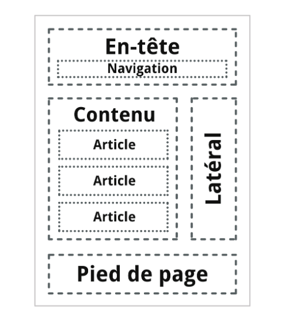
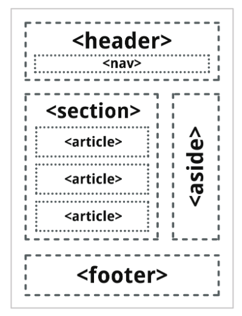

# S4

## Section

Donner les balises des sections de l'image suivante :



%



## Découpage

Peut t'on mettre des ```section``` dans des ```articles``` ?

%

Oui

## Découpage

Peut t'on mettre des ```articles``` dans des ```section``` ?

%

Oui

## Form

Que fais l'attribut ```action``` dans un formulaire ?

%

url de la cible qui recevra les donners.

## Ul

A quoi correspond la balise ```Ul``` et que mettre dedans ?

%

Il s'agit d'une liste non ordonné, il faut mettre des balises ```li``` dedans.

## Encodage

Comment donner un certain encodage a une page html ?

%

Il faut une balise
<meta charset="UTF-8">

## Langue

Comment donner la langue d'une page html ?

%

Dans la balise <html lang="fr">

## Doctype

Comment donner le doctype d'un fichier html 5

%

<!DOCTYPE html>

## Formulaire

Donner la definition minimal d'un formulaire de nom, date naissance, email,
couleur.

%

<form action="google.com" method="GET">
  <input type="text" name="name">
  <input type="date" name="date de naissance">
  <input type="color" name="couleur préférées">
  <input type="email">
  <input type="submit" value="send">
</form>

## Formulaire

Comment rendre champs d'un formulatire obligatoire pour l'envoye ?

%

required
