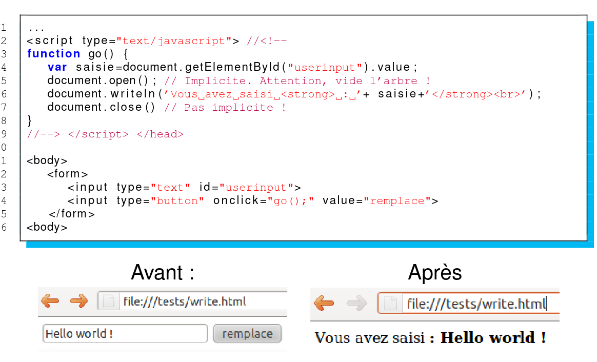

# S6

## Liste noeud

Comment récupérer l'ensemble des noeuds d'un certain type en js ?

%

```js
document.getElementByTagName("balise");
```

## Creation

Comment créer une balise ```<p>``` a l'aide du dom en js ?

%

```js
document.createElement("p");
```

## Document

Quels enfants un Document peut-il avoir ?  

%

Element (un max), ProcessingInstruction, Comment, DocumentType (un max)  

## DocumentFragment

Quels enfants un DocumentFragment peut-il avoir ?  

%

Element, ProcessingInstruction, Comment, Text, CDATASection, EntityReference  

## DocumentType

Quels enfants un DocumentType peut-il avoir ?  

%

Aucun enfant  

## EntityReference

Quels enfants un EntityReference peut-il avoir ?  

%

Element, ProcessingInstruction, Comment, Text, CDATASection, EntityReference  

## Element 

Quels enfants un Element peut-il avoir ?  

%

Element, Text, Comment, ProcessingInstruction, CDATASection, EntityReference  

## Attr

Quels enfants un Attr peut-il avoir ?  

%

Text, EntityReference  

## ProcessingInstruction

Quels enfants un ProcessingInstruction peut-il avoir ?  

%

Aucun enfant  

## Comment -> aucun enfant  

Quels enfants un Comment peut-il avoir ?  

%

Aucun enfant  

## Text -> aucun enfant  

Quels enfants un Text peut-il avoir ?  

%

Aucun enfant  

## CDATASection -> aucun enfant  

Quels enfants un CDATASection peut-il avoir ?  

%

Aucun enfant  

## Entity -> Element, ProcessingInstruction, Comment, Text, CDATASection, EntityReference  

Quels enfants un Entity peut-il avoir ?  

%

Element, ProcessingInstruction, Comment, Text, CDATASection, EntityReference  

## Notation -> aucun enfant  

Quels enfants un Notation peut-il avoir ?  

%

Aucun enfant  

## Node  

Qu'est-ce qu'un Node dans un arbre DOM ?  

%

Un noeud d’un arbre DOM (e.g. document, element, attributes, etc.) qui hérite de ses méthodes et propriétés.  

## Document  

Qu'est-ce qu'un Document dans le DOM ?  

%

Un document HTML, XHTML, et XML qui implémente l’interface "Document".  

## Element  

Qu'est-ce qu'un Element dans le DOM ?  

%

Un élément qui représente une balise et son contenu, et qui hérite de Node (interface pour les noeuds).  

## NodeList  

Qu'est-ce qu'une NodeList dans le DOM ?  

%

Une liste ordonnée de noeuds telle que renvoyée par document.getElementsByTagName(). Les éléments d’une NodeList sont accessibles par une méthode : list.item(i), différent de list[i].  

## Attribute  

Qu'est-ce qu'un Attribute dans le DOM ?  

%

Un Attribute représente un attribut d’un élément.  

## NamedNodeMap  

Qu'est-ce qu'un NamedNodeMap dans le DOM ?  

%

Comme une NodeList, mais qui donne accès aux éléments à la fois par leur nom ou par leur index.  

## DOM : URI de base d'un noeud  

Quelle méthode renvoie l'URI de base d'un noeud ?  

%

baseURI  

## DOM : noeuds enfants d'un noeud  

Quelle méthode renvoie la NodeList des noeuds enfants d'un noeud ?  

%

childNodes  

## DOM : premier enfant d'un noeud  

Quelle méthode renvoie le premier enfant d'un noeud ?  

%

firstChild  

## DOM : dernier enfant d'un noeud  

Quelle méthode renvoie le dernier enfant d'un noeud ?  

%

lastChild  

## DOM : partie locale du nom d'un noeud  

Quelle méthode renvoie la partie locale du nom d'un noeud ?  

%

localName  

## DOM : URI de l'espace de noms d'un noeud  

Quelle méthode renvoie l'URI de l'espace de noms d'un noeud ?  

%

namespaceURI  

## DOM : noeud immédiatement suivant  

Quelle méthode renvoie le noeud immédiatement suivant un noeud ?  

%

nextSibling  

## DOM : nom d'un noeud  

Quelle méthode renvoie le nom d'un noeud, selon son type ?  

%

nodeName  

## DOM : type d'un noeud  

Quelle méthode renvoie le type d'un noeud ?  

%

nodeType  

## DOM : valeur d'un noeud  

Quelle méthode permet de définir ou renvoyer la valeur d'un noeud, selon son type ?  

%

nodeValue  

## DOM : élément racine d'un noeud  

Quelle méthode renvoie l'élément racine (document object) d'un noeud ?  

%

ownerDocument  

## DOM : noeud parent d'un noeud  

Quelle méthode renvoie le noeud parent d'un noeud ?  

%

parentNode  

## DOM : préfixe de l'espace de noms  

Quelle méthode permet de définir ou renvoyer le préfixe de l'espace de noms d'un noeud ?  

%

prefix  

## DOM : noeud immédiatement précédent  

Quelle méthode renvoie le noeud immédiatement avant un noeud ?  

%

previousSibling  

## DOM : contenu textuel d'un noeud  

Quelle méthode permet de définir ou renvoyer le contenu textuel d'un noeud et de ses descendants ?  

%

textContent  

## DOM : ajouter un noeud à la fin des enfants  

Quelle méthode ajoute un noeud à la fin de la liste des enfants d'un noeud ?  

%

appendChild()  

## DOM : cloner un noeud  

Quelle méthode clone un noeud ?  

%

cloneNode()  

## DOM : comparer la position de deux noeuds  

Quelle méthode compare la position dans le document de deux noeuds ?  

%

compareDocumentPosition()  

## DOM : vérifier si un noeud a des attributs  

Quelle méthode renvoie true si un noeud a des attributs ?  

%

hasAttributes()  

## DOM : vérifier si un noeud a des noeuds enfants  

Quelle méthode renvoie true si un noeud a des noeuds enfants ?  

%

hasChildNodes()  

## DOM : insérer un noeud avant un noeud existant  

Quelle méthode insère un nouveau noeud avant un noeud enfant existant ?  

%

insertBefore(new,ref)  

## DOM : vérifier si deux noeuds sont égaux  

Quelle méthode vérifie si deux noeuds sont égaux ?  

%

isEqualNode(n)  

## DOM : vérifier si deux noeuds sont identiques  

Quelle méthode vérifie si deux noeuds sont le même noeud ?  

%

isSameNode(n)  

## DOM : retirer un noeud enfant  

Quelle méthode retire un noeud enfant ?  

%

removeChild(n)  

## DOM : remplacer un noeud enfant  

Quelle méthode remplace un noeud enfant ?  

%

replaceChild(new,old)  

## DOM : associer un objet à une clé sur un noeud  

Quelle méthode associe un objet à une clé sur un noeud ?  

%

setUserData(key,data,handler)  

## DOM : liste des attributs d'un élément  

Quelle propriété renvoie une NamedNodeMap des attributs pour un élément ?  

%

attributes  

## DOM : nom de la balise d'un élément  

Quelle propriété renvoie le nom (markup) de l'élément ?  

%

tagName  

## DOM : valeur d'un attribut  

Quelle méthode renvoie la valeur d'un attribut ?  

%

getAttribute()  

## DOM : renvoyer un noeud d'attribut en tant qu'objet Attribute  

Quelle méthode renvoie un noeud d'attribut en tant qu'objet Attribute ?  

%

getAttributeNode()  

## DOM : obtenir une NodeList des éléments correspondant à un nom de balise  

Quelle méthode renvoie une NodeList des noeuds d'éléments correspondants, et leurs enfants ?  

%

getElementsByTagName()  

## DOM : supprimer un attribut spécifié  

Quelle méthode supprime un attribut spécifié ?  

%

removeAttribute()  

## DOM : supprimer un noeud d'attribut spécifié  

Quelle méthode supprime un noeud d'attribut spécifié ?  

%

removeAttributeNode()  

## DOM : ajouter un nouvel attribut  

Quelle méthode ajoute un nouvel attribut ?  

%

setAttribute()  

## DOM : ajouter un nouveau noeud d'attribut  

Quelle méthode ajoute un nouveau noeud d'attribut ?  

%

setAttributeNode()  

## DOM : définir ou renvoyer une touche d'accès pour un élément  

Quelle propriété permet de définir ou renvoyer une touche d'accès pour un élément ?  

%

accessKey  

## DOM : définir ou renvoyer l'attribut de classe d'un élément  

Quelle propriété permet de définir ou renvoyer l'attribut de classe d'un élément ?  

%

className  

## DOM : hauteur/largeur visible du contenu sur une page  

Quelles propriétés renvoient la hauteur et la largeur visibles du contenu sur une page ?  

%

clientHeight, clientWidth  

## DOM : définir ou renvoyer la direction du texte d'un élément  

Quelle propriété permet de définir ou renvoyer la direction du texte d'un élément ?  

%

dir  

## DOM : définir ou renvoyer si un élément est désactivé  

Quelle propriété permet de définir ou renvoyer si un élément est désactivé ou non ?  

%

disabled  

## DOM : définir ou renvoyer l'id d'un élément  

Quelle propriété permet de définir ou renvoyer l'id d'un élément ?  

%

id  

## DOM : définir ou renvoyer le contenu HTML d'un élément  

Quelle propriété permet de définir ou renvoyer le contenu HTML (et texte) d'un élément ?  

%

innerHTML  

## DOM : définir ou renvoyer le code de langue d'un élément  

Quelle propriété permet de définir ou renvoyer le code de langue d'un élément ?  

%

lang  

## DOM : définir ou renvoyer l'attribut de style d'un élément  

Quelle propriété permet de définir ou renvoyer l'attribut de style d'un élément ?  

%

style  

## DOM : définir ou renvoyer l'ordre de tabulation d'un élément  

Quelle propriété permet de définir ou renvoyer l'ordre de tabulation d'un élément ?  

%

tabIndex  

## DOM : définir ou renvoyer l'attribut de titre d'un élément  

Quelle propriété permet de définir ou renvoyer l'attribut de titre d'un élément ?  

%

title  

## DOM : enlever le focus d'un élément  

Quelle méthode enlève le focus d'un élément ?  

%

blur()  

## DOM : exécuter un clic sur un élément  

Quelle méthode exécute un clic sur un élément ?  

%

click()  

## DOM : donner le focus à un élément  

Quelle méthode donne le focus à un élément ?  

%

focus()  

## DOM : renvoyer un élément en fonction de son index dans l'arborescence du document  

Quelle méthode renvoie un élément en fonction de son index dans l'arborescence 
du document ?  

%

item()  

## DOM : convertir un élément en chaîne de caractères  

Quelle méthode convertit un élément en une chaîne de caractères ?  

%

toString()  

## HTML Document 

Quelle propriété de `document` renvoie tous les paires nom/valeur des cookies 
dans le document ?  

%

cookie  

## HTML Document 

Quelle propriété de `document` renvoie le mode de rendu utilisé par le 
navigateur ?  

%

documentMode  

## HTML Document

Quelle propriété de `document` renvoie le nom de domaine du serveur qui a chargé
 le document ?  

%

domain  

## HTML Document

Quelle propriété de `document` renvoie la date et l'heure de la dernière 
modification du document ?  

%

lastModified  

## HTML Document

Quelle propriété de `document` renvoie l'état (loading) du document ?  

%

readyState  

## HTML Document 

Quelle propriété de `document` renvoie l'URL du document qui a chargé le 
document actuel ?  

%

referrer  

## HTML Document

Quelle propriété de `document` permet de définir ou renvoyer le titre du 
document ?  

%

title  

## HTML Document

Quelle propriété de `document` renvoie l'URL complète du document ?  

%

URL  

## HTML Document 

Quelle méthode ferme le flux de sortie précédemment ouvert avec `open()` ?  

%

close()  

## HTML Document

Quelle méthode de `document` permet d'accéder au premier élément avec l'id 
spécifié ?  

%

getElementById()  

## HTML Document

Quelle méthode permet d'accéder à tous les éléments avec un nom spécifié ?  

%

getElementsByName()  

## HTML Document

Quelle méthode permet d'accéder à tous les éléments avec un nom de balise 
spécifié ?  

%

getElementsByTagName()  

## HTML Document

Quelle méthode ouvre un flux de sortie pour collecter la sortie de `write()` 
ou `writeln()` ?  

%

open()  

## HTML Document

Quelle méthode permet d'écrire des expressions HTML ou du code JavaScript dans 
un document ?  

%

write()  

## HTML Document

Quelle méthode est similaire à `write()`, mais ajoute un caractère de nouvelle 
ligne après chaque instruction ?  

%

writeln()  

## HTML

Qu'elle particularité y a t'il sur la méthode `getElementById()` ?

%

Elle n'est disponible que sur l'objet `document`.

## HTML

Quelle sont les objets qui admet ces méthodes ?

```js
close(), getElementsByName(), getElementsByTagName(), open(), write(), writeln()
```

%

===========================================================================================================================================

## HTML

Dire a quoi sert les méthodes `open` et `close` ?

%



## HTML

Que ce passe t'il si l'on `close()` pas après un `open()` dans le dom ?

%

Le navigateur va avoir le truc qui tourne en boucle pour attendre la fin de 
l'écriture.

## HTML Form

Quelle propriété permet de définir ou d'obtenir l'encodage des caractères que le 
serveur accepte lors de la soumission d'un formulaire ?  

%

acceptCharset  

## HTML Form

Quelle propriété permet de définir ou d'obtenir l'URL où les données du 
formulaire seront envoyées lors de la soumission ?  

%

action  

## HTML Form

Quelle propriété permet de définir ou d'obtenir le type de contenu utilisé pour 
soumettre les données du formulaire ?  

%

enctype  

## HTML Form

Quelle propriété renvoie le nombre total d'éléments contenus dans le 
formulaire ?  

%

length  

## HTML Form

Quelle propriété permet de définir ou d'obtenir la méthode HTTP (`GET` ou 
`POST`) utilisée pour soumettre le formulaire ?  

%

method  

## HTML Form 

Quelle propriété permet de définir ou d'obtenir le nom attribué au formulaire ?  

%

name  

## HTML Form

Quelle propriété permet de définir ou d'obtenir la cible où la réponse du 
serveur sera affichée après la soumission du formulaire ?  

%

target  

## HTML Form

Quelle gestionaire d'évènement est appelée lorsque le bouton de réinitialisation 
est cliqué dans un formulaire ?  

%

onreset  

## HTML Form

Quelle gestionaire d'évènement est appelée lorsque le bouton de soumission est 
cliqué dans un formulaire ?  

%

onsubmit  

## Form

Comment `onsumbit` peut t'il stopper l'envoie d'un formulaire ?

%

La fonction liée au gestionaire renvoie un booléan :
- `true` => envoie le formulaire
- `false` => n'envoie pas le formulaire

## Style

Pour quelle raison le js n'admet pas `background-color` comme propriété de 
style ?

%

Car le symbole `-` est un opérateur

## DOM

Comment créer une node contenant du CDATA en dom ?

%

```js
createTextNode("<le text>");
```
Il suffit après d'append cette node à la balise que l'on veut envoyer.

## DOM

Qu'est t'il préférable de faire pour ajouter une structure complex 
dinamyquement.

%

De d'abord construire la structure puis après de l'`appendChild` mais vraiment 
à la fin. 

## DOM

Que faut t'il faire plutôt que de créer dynamiquement des sous arbres ?

%

Il faut mieux avoir un contenu static 'caché' puis cloner pour avoir au moins 
de la validation a l'aide de __W3C__.

## Retour DOM

Quelle est le type des containeurs retourner par les méthodes `getElements*` ?

%

Une `NodeList`.

## NodeList

Quelle particularité y a t'il sur le type `NodeList` ?

%

Une `NodeList` est une vue a tout moment sur une propriété de l'arbre, a tout 
moment elle correspond vraiement a ce qu'il y a actuellement donc tout ce 
change.

## Input

Qu'elle spécificité y a t'il entre une balise `input` et `form` ?

%

On ne peut pas mettre un `input` en enfant direct d'un `form`, il faut mettre 
le `input` dans un conteneur.